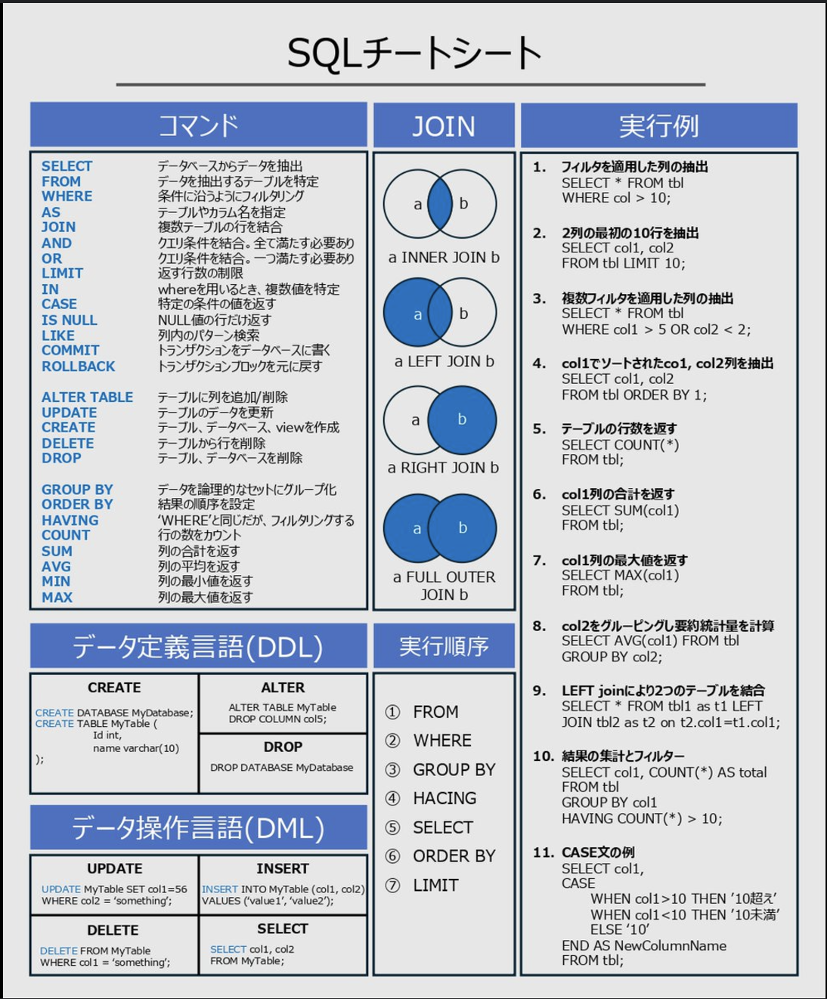
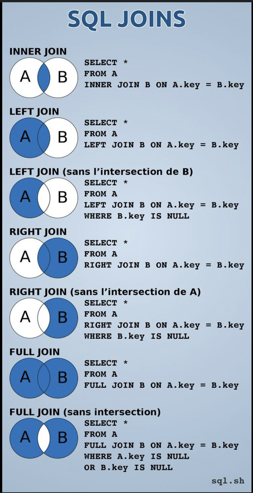
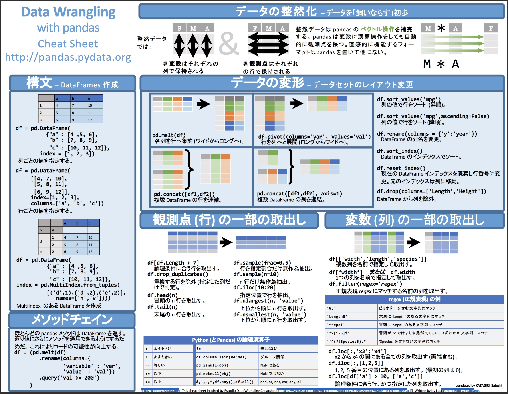
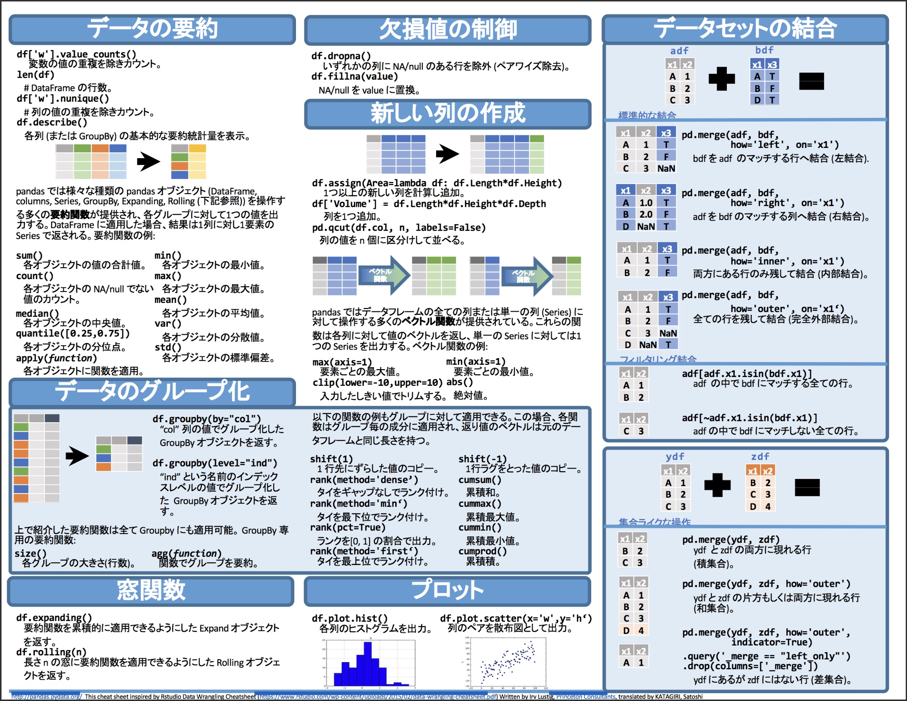

# 目次
- [目次](#目次)
- [目的](#目的)
- [背景](#背景)
- [ref](#ref)
- [内容](#内容)
  - [SQLエンジンについて](#sqlエンジンについて)
  - [SQLチートシート](#sqlチートシート)
  - [Pandasチートシート](#pandasチートシート)
# 目的
- よく使うSQLや各種SQLエンジンの特徴などまとめる
# 背景
- 複数のSQLエンジン(presto/hive/spark)を使っているため、違いや理解度を深めたい
# ref
- [分散処理に入門してみた（Hadoop+Spark）](https://www.casleyconsulting.co.jp/blog/engineer/150/)
- [Hadoop関連の用語をざっくりまとめる【Hive, Presto, Spark】](https://qiita.com/tetsuro731/items/64abce51021c904bb7ab#%E3%82%AF%E3%82%A8%E3%83%AA%E3%82%A8%E3%83%B3%E3%82%B8%E3%83%B3)
- [Apache Hive 概要 / HiveQL チートシート](https://qiita.com/esakik/items/c9659e2496362b914e6d)
- [Hive vs Presto vs Spark for Data Analysis](https://ahana.io/learn/comparisons/hive-vs-presto-vs-spark/)
- 
# 内容
## SQLエンジンについて
  - Presto
    - 特徴
      - ANSI SQL
      - メモリ上で処理
    - 使用用途
      - 分析者が対話型でアドホックにクエリしたいとき
  - Hive
    - 特徴
      - HiveQL(SQLライクなやつ)
      - MapReduce処理で中間データをディスクに書き出して処理
    - 使用用途 
      - バッチ処理
  - Spark SQL
    - 特徴
      - ANSI SQL
      - 高速化されたMapReduce
      - 中間データをメモリで処理
    - 使用用途
      - 機械学習/リアルタイム処理(ストリーム処理)/グラフ計算
## SQLチートシート
  - これ見ておけば大丈夫
    - 

    - 

## Pandasチートシート
  - これ見ておけば大丈夫
  - 

  - 

