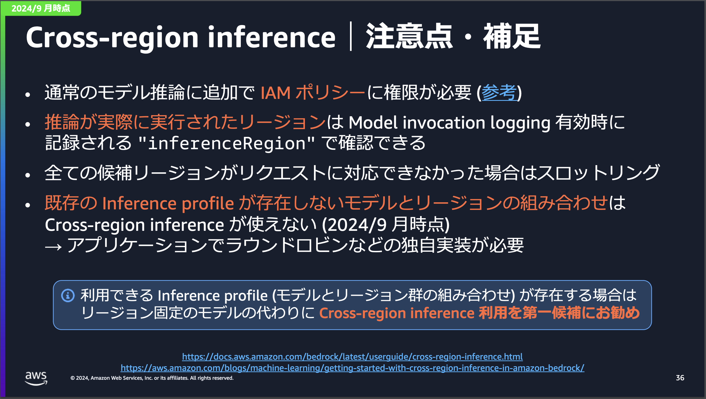

# 目次
- [目次](#目次)
- [目的](#目的)
- [背景](#背景)
- [参考](#参考)
- [内容](#内容)
  - [Amazon Bedrock Overview 【Amazon Bedrock Series #01】](#amazon-bedrock-overview-amazon-bedrock-series-01)
  - [LLMOps:ΔMLOps by MS ito shunta](#llmopsδmlops-by-ms-ito-shunta)
  - [Amazon Bedrock モデル推論 a.準備編 【Amazon Bedrock Series #02a】](#amazon-bedrock-モデル推論-a準備編-amazon-bedrock-series-02a)
# 目的
- Bedrockのキャッチアップ
# 背景
# 参考
- [Amazon Bedrock Overview 【Amazon Bedrock Series #01】](https://pages.awscloud.com/rs/112-TZM-766/images/AWS-Black-Belt_2024_Amazon-Bedrock-Overview_v1.pdf)
# 内容
## [Amazon Bedrock Overview 【Amazon Bedrock Series #01】](https://pages.awscloud.com/rs/112-TZM-766/images/AWS-Black-Belt_2024_Amazon-Bedrock-Overview_v1.pdf)
  - 

  - 

  - 

  - 

  - 

  - 

  - 

  - 

  - 

  - 

  - 

  - 

  - 

  - 

  - 

  - 

  - 

  - 

  - cross-regionについて(別資料)
    - 

    - 

    - 

    - 

  - 

  - 

## [LLMOps:ΔMLOps by MS ito shunta](https://speakerdeck.com/shuntaito/llmops-dmlops)
  - 

  - 

  - 

  - 
## [Amazon Bedrock モデル推論 a.準備編 【Amazon Bedrock Series #02a】](https://pages.awscloud.com/rs/112-TZM-766/images/AWS-Black-Belt_2024_Amazon-Bedrock-Model-Inference-a_0909_v1.pdf)