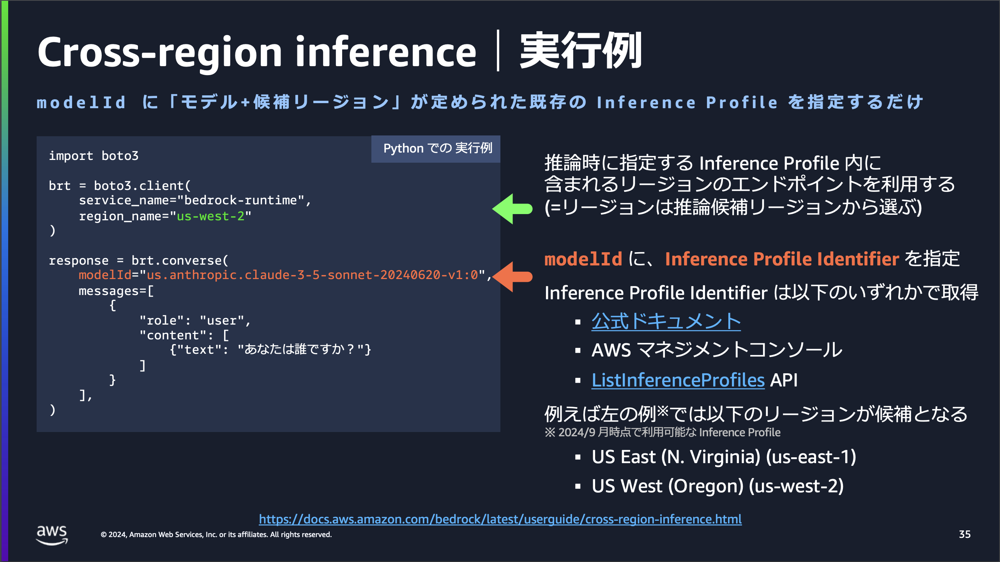
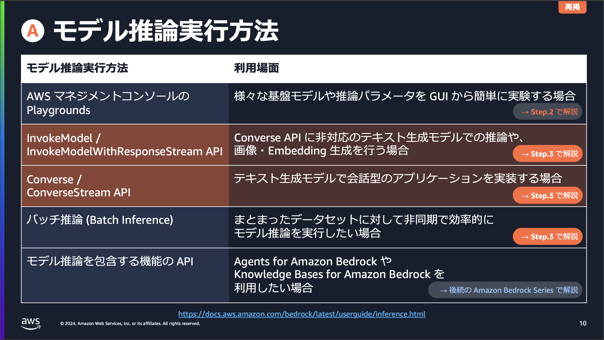
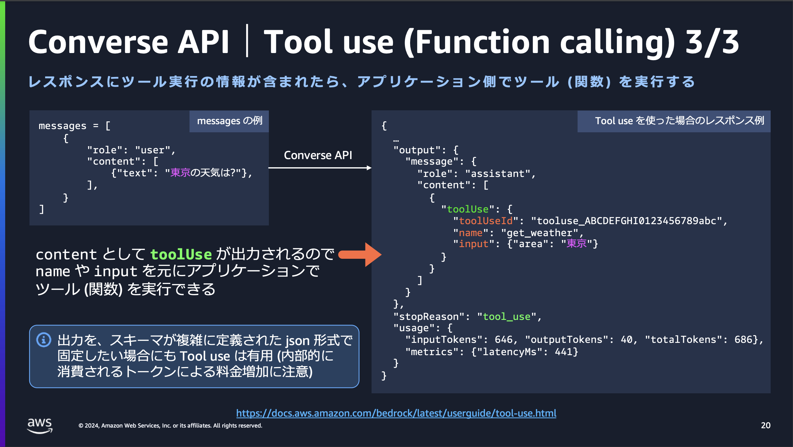
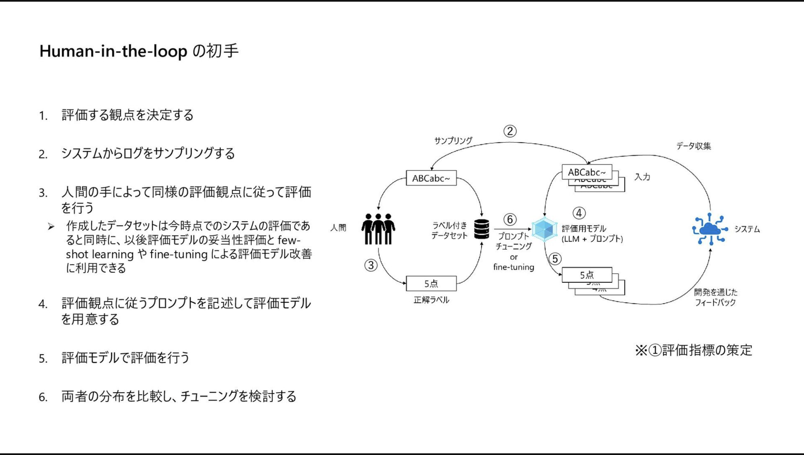
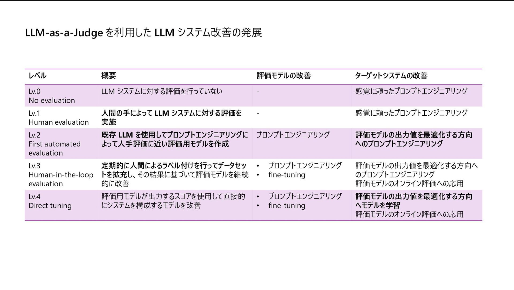
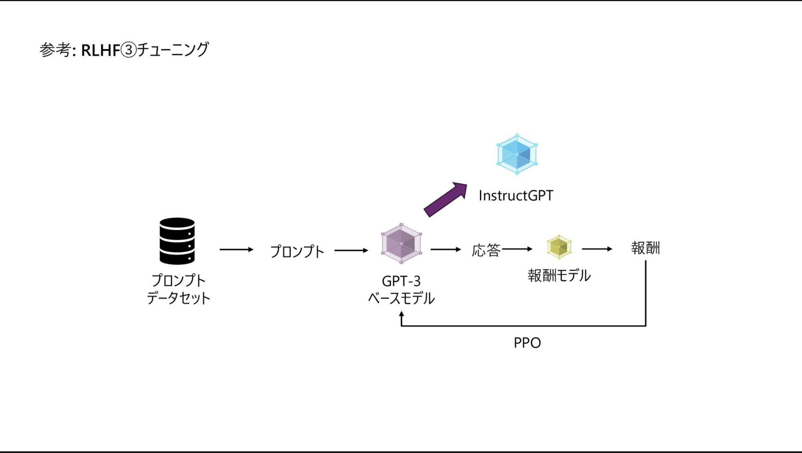
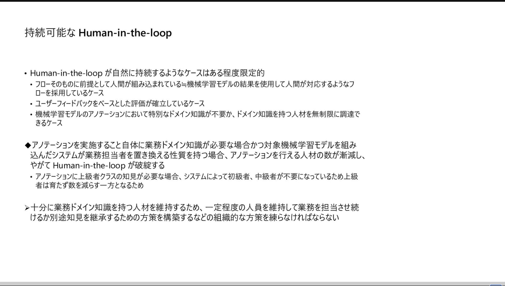

# 目次
- [目次](#目次)
- [目的](#目的)
- [背景](#背景)
- [参考](#参考)
- [内容](#内容)
  - [AWS](#aws)
    - [Amazon Bedrock Overview 【Amazon Bedrock Series #01】](#amazon-bedrock-overview-amazon-bedrock-series-01)
    - [Amazon Bedrock モデル推論 a.準備編 【Amazon Bedrock Series #02a】](#amazon-bedrock-モデル推論-a準備編-amazon-bedrock-series-02a)
    - [Amazon Bedrock モデル推論 b.実践編 【Amazon Bedrock Series #02b】](#amazon-bedrock-モデル推論-b実践編-amazon-bedrock-series-02b)
    - [Amazon Bedrock Agents 自律型 AI の実現に向けて: 検討編 【Amazon Bedrock Series #04a】](#amazon-bedrock-agents-自律型-ai-の実現に向けて-検討編-amazon-bedrock-series-04a)
    - [Amazon Bedrock Knowledge Bases](#amazon-bedrock-knowledge-bases)
  - [GCP](#gcp)
    - [GenOps: 生成 AI 向けに MLOps が進化](#genops-生成-ai-向けに-mlops-が進化)
    - [GenOps: マイクロサービスと従来の DevOps の世界から学ぶ](#genops-マイクロサービスと従来の-devops-の世界から学ぶ)
  - [Azure](#azure)
    - [LLMOps:ΔMLOps by MS ito shunta](#llmopsδmlops-by-ms-ito-shunta)
    - [Azure ベースライン OpenAI エンドツーエンド チャット リファレンス アーキテクチャ](#azure-ベースライン-openai-エンドツーエンド-チャット-リファレンス-アーキテクチャ)
    - [Azure OpenAI モデルのログと監視を実装する](#azure-openai-モデルのログと監視を実装する)
    - [Azure Databricks を使用して MLOps を調整する](#azure-databricks-を使用して-mlops-を調整する)
    - [マルチモーダル/AI Agent/LLMOps 3つの技術トレンドで理解するLLMの今後の展望](#マルチモーダルai-agentllmops-3つの技術トレンドで理解するllmの今後の展望)
    - [ChatGPT - LLMシステム開発大全](#chatgpt---llmシステム開発大全)
    - [AOAI Dev Day LLMシステム開発 Tips集](#aoai-dev-day-llmシステム開発-tips集)
    - 
# 目的
- LLMOpsの勉強
# 背景
# 参考
- [プロンプトエンジニアリングによる、Amazon Bedrock でのセキュアな RAG アプリケーション](https://aws.amazon.com/jp/blogs/news/secure-rag-applications-using-prompt-engineering-on-amazon-bedrock/)
- [【AWS】BedrockのAgentを使ったら1時間弱でRAGを構築できた](https://zenn.dev/ncdc/articles/41bf6e7735ec9f)
# 内容
## AWS
### [Amazon Bedrock Overview 【Amazon Bedrock Series #01】](https://pages.awscloud.com/rs/112-TZM-766/images/AWS-Black-Belt_2024_Amazon-Bedrock-Overview_v1.pdf)
  - 

  - 

  - 

  - 

  - 

  - 

  - 

  - 

  - 

  - 

  - 

  - 

  - 

  - 

  - 

  - 

  - 

  - 

  - cross-regionについて(別資料)
    - 

    - 

    - 

    - 

  - 

  - 

### [Amazon Bedrock モデル推論 a.準備編 【Amazon Bedrock Series #02a】](https://pages.awscloud.com/rs/112-TZM-766/images/AWS-Black-Belt_2024_Amazon-Bedrock-Model-Inference-a_0909_v1.pdf)
  - 

  - 

  - 

  - 

  - 

  - 

  - 

  - 

  - 

  - 

  - 

  - 

  - 

  - 

### [Amazon Bedrock モデル推論 b.実践編 【Amazon Bedrock Series #02b】](https://pages.awscloud.com/rs/112-TZM-766/images/AWS-Black-Belt_2024_Amazon-Bedrock-Model-Inference-b_0909_v1.pdfs)
  - 

  - 

  - 

  - 

  - 

  - 

  - 

  - 

  - 

  - 

  - 

  - 

  - 

  - 

### [Amazon Bedrock Agents 自律型 AI の実現に向けて: 検討編 【Amazon Bedrock Series #04a】](https://pages.awscloud.com/rs/112-TZM-766/images/AWS-Black-Belt_2024_Amazon-Bedrock-Agents_0930_v1.pdf)
  - 

  - 

  - 

  - 

  - 

  - 

  - 

  - 

  - 

  - 

  - 

  - 

  - 

  - 

  - 

  - 

  - 

### [Amazon Bedrock Knowledge Bases](https://pages.awscloud.com/rs/112-TZM-766/images/AWS-Black-Belt_2024_Amazon-Bedrock-Knowledge-Bases_0920_v1.pdf)
  - 

  - 

  - 

  - 

  - 

  - 

  - 

  - 

  - 

  - 

  - 

  - 

  - 

  - 

  - 

  - 

  - 

  - 

  - 

  - 

  - 

  - 

  - 

  - 

  - 

  - 

  - 

  - 

  - 

  - 

  - 

  - 

  - 

 
  - 

  - 

  - 

  - 

  - 

## GCP
### [GenOps: 生成 AI 向けに MLOps が進化](https://cloud.google.com/blog/ja/products/ai-machine-learning/learn-how-to-build-and-scale-generative-ai-solutions-with-genops)
  - 

  - 

  - 

  - 

### [GenOps: マイクロサービスと従来の DevOps の世界から学ぶ](https://cloud.google.com/blog/ja/products/devops-sre/genops-learnings-from-microservices-and-traditional-devops)
  - 

  - 

  - 

  - 

  - 

## Azure
### [LLMOps:ΔMLOps by MS ito shunta](https://speakerdeck.com/shuntaito/llmops-dmlops)
  - 

  - 

  - 

  - 

  - 

  - 

  - 

  - 

  - 

  - 

  - 

  - 

  - 

  - 

  - 

  - 

  - 

  - 

  - 

  - 

  - 

  - 

  - 

  - 

  - 

  - 

  - 

  - 

  - 

  - 

  - 

  - 

### [Azure ベースライン OpenAI エンドツーエンド チャット リファレンス アーキテクチャ](https://learn.microsoft.com/ja-jp/azure/architecture/ai-ml/architecture/baseline-openai-e2e-chat)
  - 

### [Azure OpenAI モデルのログと監視を実装する](https://learn.microsoft.com/ja-jp/azure/architecture/ai-ml/openai/architecture/log-monitor-azure-openai)
  - 

### [Azure Databricks を使用して MLOps を調整する](https://learn.microsoft.com/ja-jp/azure/architecture/ai-ml/idea/orchestrate-machine-learning-azure-databricks)
  - 

### [マルチモーダル/AI Agent/LLMOps 3つの技術トレンドで理解するLLMの今後の展望](https://speakerdeck.com/hirosatogamo/llmops-3tunoji-shu-torendodeli-jie-surullmnojin-hou-nozhan-wang)
  - 

  - 

  - 
### [ChatGPT - LLMシステム開発大全](https://speakerdeck.com/hirosatogamo/chatgpt-azure-openai-da-quan)
### [AOAI Dev Day LLMシステム開発 Tips集](https://speakerdeck.com/hirosatogamo/aoai-dev-day-llmsisutemukai-fa-tipsji)
### 
