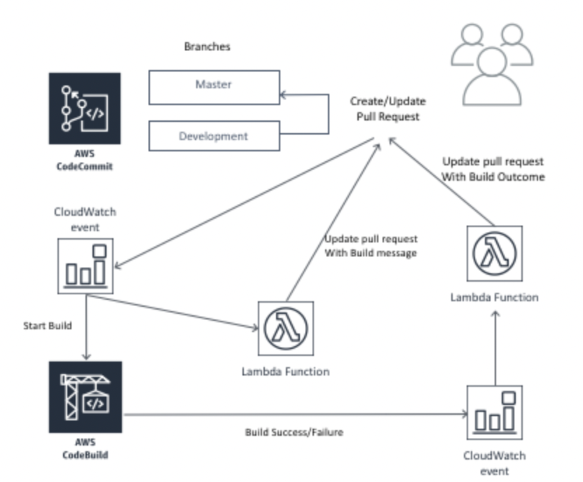
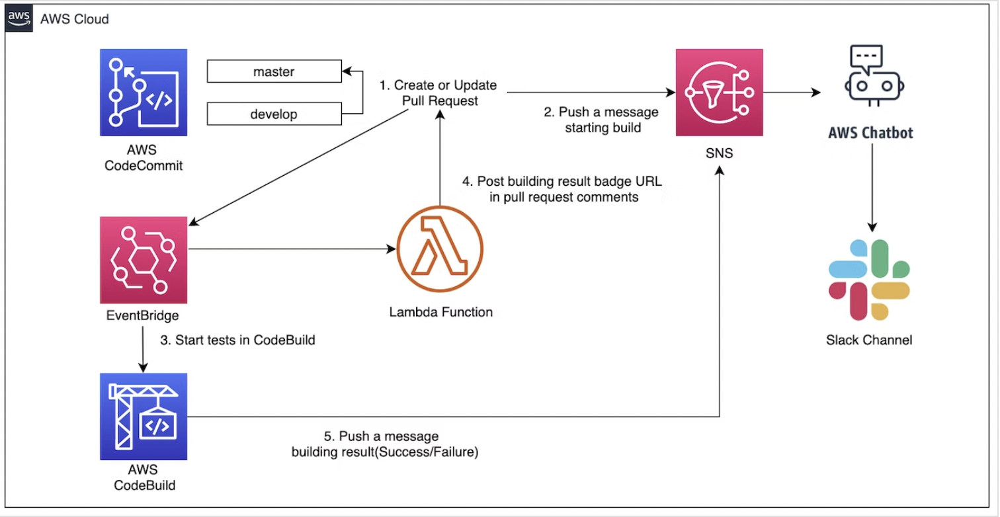
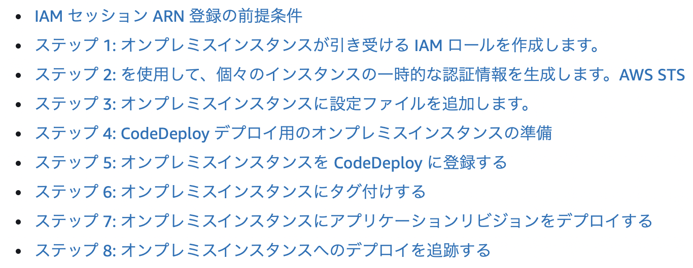
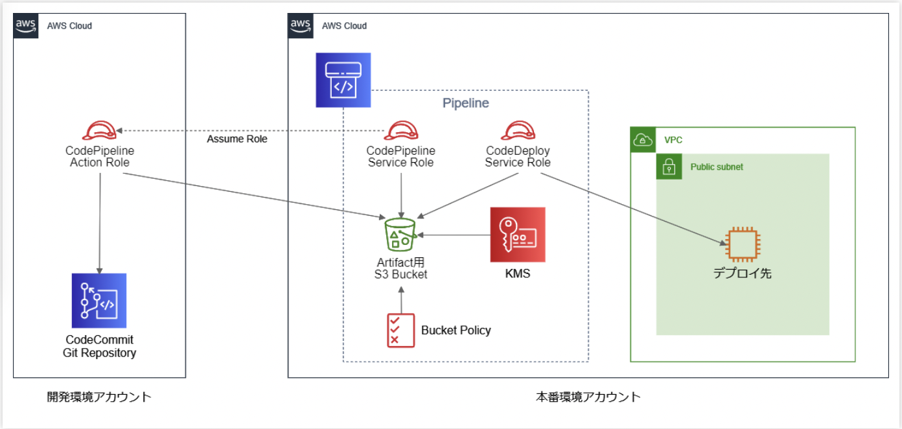
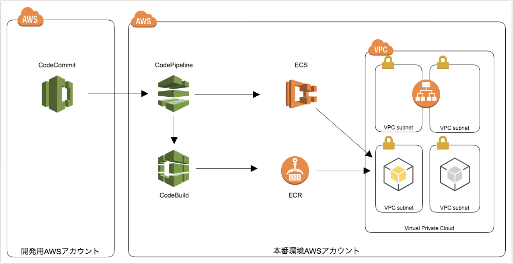

# 目次
- [目次](#目次)
- [目的](#目的)
- [背景](#背景)
- [参考](#参考)
- [内容](#内容)
  - [Codeシリーズ全般](#codeシリーズ全般)
  - [CodeCommit](#codecommit)
  - [CodeBuild](#codebuild)
  - [CodeDeploy](#codedeploy)
  - [CodePipeeline](#codepipeeline)
  - [CI/CDツール一覧](#cicdツール一覧)
  - [AWSにおけるクロスアカウントでのCI/CD実装](#awsにおけるクロスアカウントでのcicd実装)
# 目的
- 資格取得を通じて理解をより深めるため
- awsを用いたシステムのアーキテクトをする際に、devopsに関する知識を初めから持っておくことで、拡張性や運用性に考慮したシステムを設計できるようにするため
# 背景
- 機械学習/分析関連のPJに参画してから１年経ち、実際の運用作業を通じてDevOps(MLOps)の重要性を痛感したから
# 参考
- [AWS Certified DevOps Engineer Professional 2022 - Hands On!](https://www.udemy.com/course/aws-certified-devops-engineer-professional-hands-on/)
# 内容
- 知らなかったことや大事なことを記載していく
## Codeシリーズ全般
- [取得できるイベント一覧](https://dev.classmethod.jp/articles/new-code-series-notification/)
## CodeCommit
- 特になし
## CodeBuild
- buildspec.yml
  - どうビルドしていくかを定義するyaml
  - [CodeBuild のビルド仕様に関するリファレンス](https://docs.aws.amazon.com/ja_jp/codebuild/latest/userguide/build-spec-ref.html#build-spec-ref-syntax)
- CodeCommitのPRをCodeBuildで検証するアーキテクチャ
  - [Validating AWS CodeCommit Pull Requests with AWS CodeBuild and AWS Lambda](https://aws.amazon.com/jp/blogs/devops/validating-aws-codecommit-pull-requests-with-aws-codebuild-and-aws-lambda/)
    - 2019年の記事でちょっと古い
    - <p align='center'></p>
    - ↓の方が今のAWSサービスに則していてシンプル
  - [CodeCommitのプルリクをCodeBuildで検証しAWS ChatbotでSlack通知する](https://qiita.com/joe-king-sh/items/d896ec66a93212e92147)
    - AWS Chatbotを用いてslack通知している
    - <p align='center'></p>
    - 自分のPJではTeamsを用いているが、ChatbotがTeams対応していないため、AWS Chatbotの代わりにLambdaで実装している（上図のChatbotをLambdaに置き換えた感じ）
      - [ウェブフックを使用して Amazon SNS メッセージを Amazon Chime、Slack、または Microsoft Teams に発行する方法を教えてください。](https://aws.amazon.com/jp/premiumsupport/knowledge-center/sns-lambda-webhooks-chime-slack-teams/)
    - SNS/Chatbotの代わりにEventBridge API Destonationを用いれば実現可能かも（上図のSNS/ChatbotをEventBridgeに置き換えた感じ）
      - [Amazon EventBridge API destinations で Microsoft Teams へ通知させる](https://dev.classmethod.jp/articles/eventbridge-teams/)
- 色んなものをビルドできるらしい（自分はDockerイメージをビルドしてECRにプッシュし、CodeDeployでECSにデプロイするアーキテクチャしか経験がない）
  - [CodeBuild ユースケースベースのサンプル](https://docs.aws.amazon.com/ja_jp/codebuild/latest/userguide/use-case-based-samples.html)
## CodeDeploy
- EC2/オンプレサーバー/Lambda/ECSへデプロイできる（ECSしか経験がないため他知らなかった）
- EKSもCodePipelineを用いればできるみたい
  - [AWS CodePipelineからEKSのPodをデプロイする](https://open-groove.net/ci-cd/aws-codepipeline-eks-deploy/)
- EC2の場合CodeDeploy Agentをあらかじめインストールしておく必要がある（SSMを用いてインストールするのが推奨されている）
  - [Install the CodeDeploy](https://docs.aws.amazon.com/codedeploy/latest/userguide/codedeploy-agent-operations-install.html)
  - [Install the CodeDeploy agent using AWS Systems Manager](https://docs.aws.amazon.com/codedeploy/latest/userguide/codedeploy-agent-operations-install-ssm.html)
- appspec.yml
  - どうデプロイしていくかを定義するyaml
  - [CodeDeploy AppSpec File reference](https://docs.aws.amazon.com/codedeploy/latest/userguide/reference-appspec-file.html)
- Deployment/Release Type
  - EC2/オンプレ
    - In-place（俗にいうRollingDeployment）
      - OnceAtATime
      - HalfAtATime
      - AllAtOnce
    - Blue/Green
      - OnceAtATime
      - HalfAtATime
      - AllAtOnce
  - Lambda/ECS（Blue/Greenの中でCanary/Linear/All-at-Onceの３種類があるとAWSでは定義している）
    - Blue/Green
      - Canary（俗にいうカナリアリリース）
      - Linear（カナリアリリースの線形バージョン）
      - All-at-Once（俗にいうBlue/Green）
  - through Cfn
    - Blue/Green
  - ※一般的にはCanaryとBlue/Greenは別のデプロイメント方式の認識だがAWSではCanaryを含む環境を２面用意する方式を広義のBlue/Greenとして定義しているみたい
  - [Working with deployments in CodeDeploy](https://docs.aws.amazon.com/codedeploy/latest/userguide/deployments.html)
  - [CodeDeploy のデプロイ方式に Blue/Green Deployment が追加されました](https://dev.classmethod.jp/articles/codedeploy-blue-green-deployment/)
- Deploy Group
  - EC2/オンプレ
    - アプリケーションをデプロイする単位は下記がある
      - Amazon EC2 ASG
      - Amazon EC2 instances
        - タグを使用してグループを定義できる
      - On-premises instances
        - タグを使用してグループを定義できる
        - オンプレの登録方法
          - IAMユーザーARNを使用してリクエストを認証する
          - IAMロールARNを使用してリクエストを認証する（STSなので↑よりセキュア）
            - 具体的な手順
            - <p align='center'></p>
          - [Register an on-premises instance with CodeDeploy](https://docs.aws.amazon.com/codedeploy/latest/userguide/on-premises-instances-register.html)
      - [CodeDeploy でのデプロイグループのインスタンスのタグ付け](https://docs.aws.amazon.com/ja_jp/codedeploy/latest/userguide/instances-tagging.html)
    - Lambda
      - ？
      - おそらくLambda Functionを指定する
    - ECS
      - ECSクラスターを指定する
- Rollback
  - ロールバック設定は下記がある
    - 無効
    - 有効
      - デプロイが失敗したときにロールバックする
      - アラームのしきい値が一致したときにロールバックする
        - 紐づけたCloudWatch Alarmsの条件を基に判断される
- デプロイするファイルをS3に置く方法（EC2/オンプレの場合のみ）
  - ファイル群がzipされてなくてもコマンド内でしてくれる
  ```
   aws deploy push \
  --application-name WordPress_App \
  --description "This is a revision for the application WordPress_App" \
  --ignore-hidden-files \
  --s3-location s3://codedeploydemobucket/WordPressApp.zip \
  --source .
  ```
  - [Push a revision for CodeDeploy to Amazon S3 (EC2/On-Premises deployments only)](https://docs.aws.amazon.com/codedeploy/latest/userguide/application-revisions-push.html)
## CodePipeeline
- ステージ/アクション/プロバイダーを定義して、CI/CDパイプラインをカスタムできるAWSサービス
- ソース(CodeCommit)→ビルド(CodeBuild)→テスト(CodeBuild)→承認(Munual)→デプロイ(CodeDeploy)みたいなパイプラインをよしなに作れる
  - ステージ
    - デフォルトの場合下記で構成され任意で定義/追加/削除できる
      - Source→Build→Deploy
  - アクション/プロバイダー(アクションを提供するリソース)
    - Source
      - CodeCommit/ECR/S3/BitBucket/GitHub/etc
    - Build
      - CodeBuild/Jenkins/etc
    - Test
      - CodeBuild/Jenkins/etc
    - Deploy
      - CodeDeploy/ECS/ECS(Blue/Green)/S3/Cfn/Cfn(StackSet)/etc
    - Approval
      - Manual(手動)
    - Invoke
      - Lambda/StepFunctions
    - 詳細は下記参照
      - [CodePipeline パイプライン構造リファレンス](https://docs.aws.amazon.com/ja_jp/codepipeline/latest/userguide/reference-pipeline-structure.html)
- Artifact Store
  - 各パイプラインの入出力アーティファクトの格納先
    - Default location
      - デフォルトのS3を新規作成
    - Custom location
      - 既存のS3を利用
  - ex.ソース(CodeCommit)→ビルド(CodeBuild)→テスト(CodeBuild)→承認(Munual)→デプロイ(CodeDeploy)の場合
    1. CodeCommitの対象ブランチをArtifact Store(S3)にプル
    2. 1.を用いてビルドし成果物をまたArtifact Store(S3)に格納
    3. 2.を用いてテストし結果をArtifact Store(S3)に格納
    4. 2.を用いてデプロイ
- Sourceの詳細設定
  - Change detection options(検出オプション)
    - Amazon CloudWatch events(Amazon EventBridge)
      - イベントトリガー(ex.リポジトリへのプッシュ/ブランチの作成など)
    - AWS CodePipeline
      - EventBridgeを用いずCodePipelineの内部機能を用いて変更を定期的にチェックする
- IaC(Cfn)での実装
  - [AWS::CodePipeline::Pipeline](https://docs.aws.amazon.com/ja_jp/AWSCloudFormation/latest/UserGuide/aws-resource-codepipeline-pipeline.html)
  - [GitHub/CodeBuild/CodePipelineを利用してCloudFormationのCI/CDパイプラインを構築する](https://dev.classmethod.jp/articles/developing-cloudformation-ci-cd-pipeline-with-github-codebuild-codepipeline/)
  - [CodePipelineを使ってCodeCommitプッシュをトリガーにしてECRにイメージをプッシュする](https://awstut.com/2022/08/14/use-codepipeline-to-trigger-codecommit-pushes-to-push-images-to-ecr/)
## CI/CDツール一覧
- AWS Codeシリーズ
- CircleCI
- Jenkins
- GitLab CI/CD
- GitHub Actions
## AWSにおけるクロスアカウントでのCI/CD実装
- [異なる AWS アカウントでアプリケーションをデプロイする](https://docs.aws.amazon.com/ja_jp/codedeploy/latest/userguide/deployments-cross-account.html)
- [別のAWSアカウントにあるCodeCommit RepositoryをソースとするCodePipelineをCloudFormationで構築してみた](https://dev.classmethod.jp/articles/cross-account-codecommit-codepipeline-with-cfn/)
  - <p align='center'></p>
- [CodePipelineでアカウントをまたいだパイプラインを作成してみる](https://dev.classmethod.jp/articles/codepipeline-cross-account/)
  - <p align='center'></p>