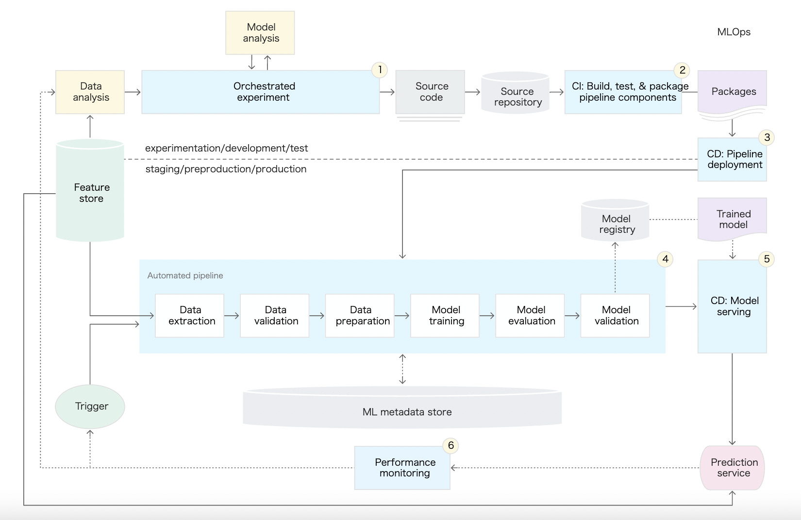

# 目次
- [目次](#目次)
- [目的](#目的)
- [背景](#背景)
- [参考](#参考)
- [内容](#内容)
  - [検証環境と商用環境におけるMLパイプラインの違いは何か？](#検証環境と商用環境におけるmlパイプラインの違いは何か)
  - [SageMakerのネットワーク設計パターン](#sagemakerのネットワーク設計パターン)
# 目的
- AWSのML関連の知識習得
# 背景
- ML/分析関連のPJに関わり始めて一年になる
- 今のPJのアーキテクチャの理解を深める
- ML/分析関連のアーキテクチャ(ex.MLパイプラインなど)のベスプラを理解し、今のPJのアーキテクチャに不足している部分を洗い出す
- 今後ゼロからML/分析関連のアーキテクチャを構築する場合、どのような考慮事項があるか網羅的に学んでおきたい
# 参考
- [AWS Certified Machine Learning Specialty 2023 - Hands On!](https://www.udemy.com/course/aws-machine-learning/)
- [2021年05月時点で自分が実践しているMLOpsの情報収集方法](https://shunyaueta.com/posts/2021-05-29/)
- [機械学習のルール](https://developers.google.com/machine-learning/guides/rules-of-ml)
- [MLOps: 機械学習における継続的デリバリーと自動化のパイプライン](https://cloud.google.com/architecture/mlops-continuous-delivery-and-automation-pipelines-in-machine-learning)
- 
- 
# 内容
## 検証環境と商用環境におけるMLパイプラインの違いは何か？
- chatGPTの回答
  - 検証環境と商用環境におけるMLパイプラインの違いは、主に以下のような点があります。
      - 数量の差: 検証環境では、少量のデータを使用してモデルを開発し、評価するために使用されます。 一方、商用環境では、大量のデータを処理し、大規模なインフラストラクチャを使用して運用されます。
      - 要件の差: 検証環境では、モデルの性能を測定するために、準確性や精度などのメトリクスが重視されます。一方、商用環境では、実際のビジネスニーズに合わせて、スケーラビリティや可用性などの要件が重視されます。
      - セキュリティーの差: 検証環境では、データのセキュリティーは重視されませんが、商用環境では、顧客データなどの個人情報の保護が求められるため、より高いセキュリティーが求められます。
      - 公開の差: 検証環境では、結果や処理結果は限られたチームや関係者にのみ公開されます。 一方、商用環境では、顧客や消費者に対して公開されるため、準確性や品質が高くなければならないです。
  - また、検証環境では、実験的なアプローチを取り、多くのパラメータを試すことができますが、商用環境では、実用性を考慮し、最適なパラメータを選択することが求められます。
  - 検証環境と商用環境では、それぞれ異なるニーズに対応しなければならないため、それぞれ独自のMLパイプラインを構築する必要があります。
- GCPの図的に表してたやつ
  - [MLOps: 機械学習における継続的デリバリーと自動化のパイプライン](https://cloud.google.com/architecture/mlops-continuous-delivery-and-automation-pipelines-in-machine-learning)
  - 

## SageMakerのネットワーク設計パターン
- [【Amazon SageMaker】ネットワーク設計パターンをまとめてみた](https://dev.classmethod.jp/articles/sagemaker-network-vpc-architecture-2022-04/)
- [閉域網で Amazon SageMaker を利用する際のポイントと手順](https://aws.amazon.com/jp/blogs/news/internet-free-sagemaker/)