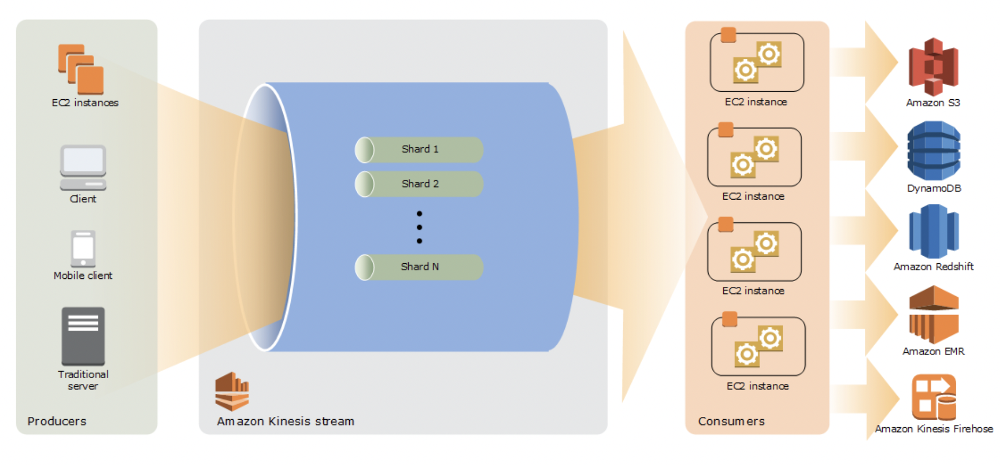
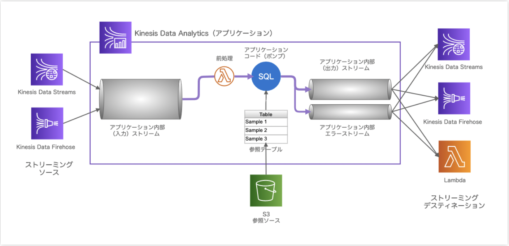
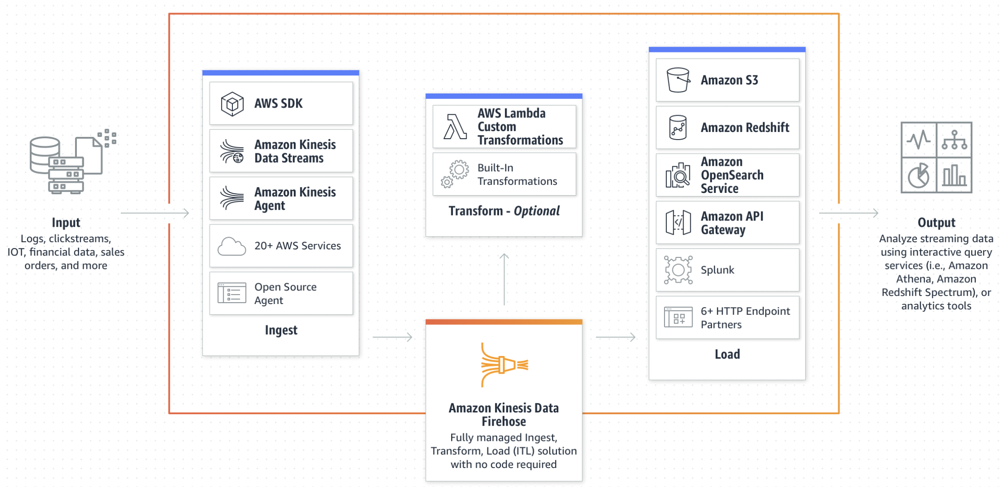
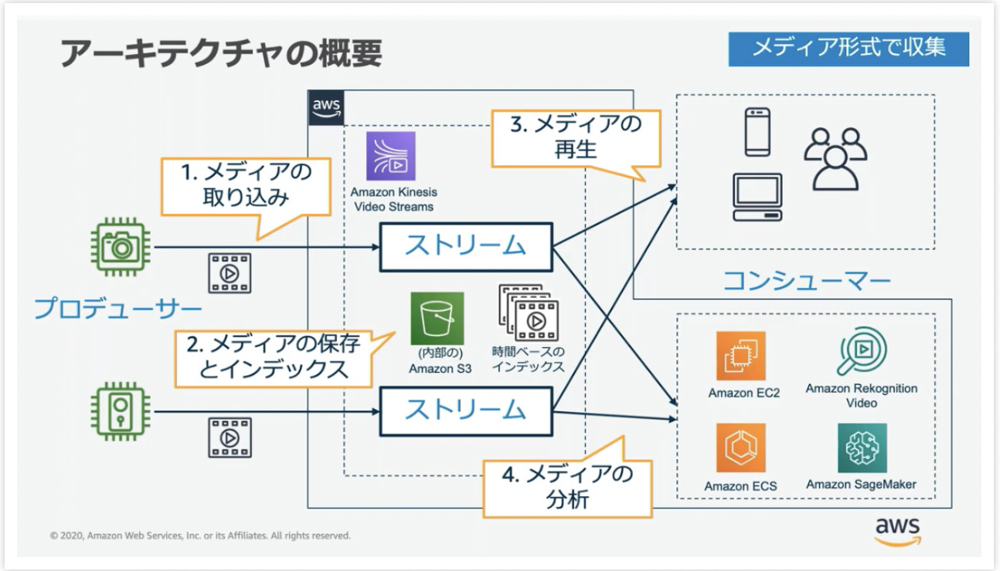
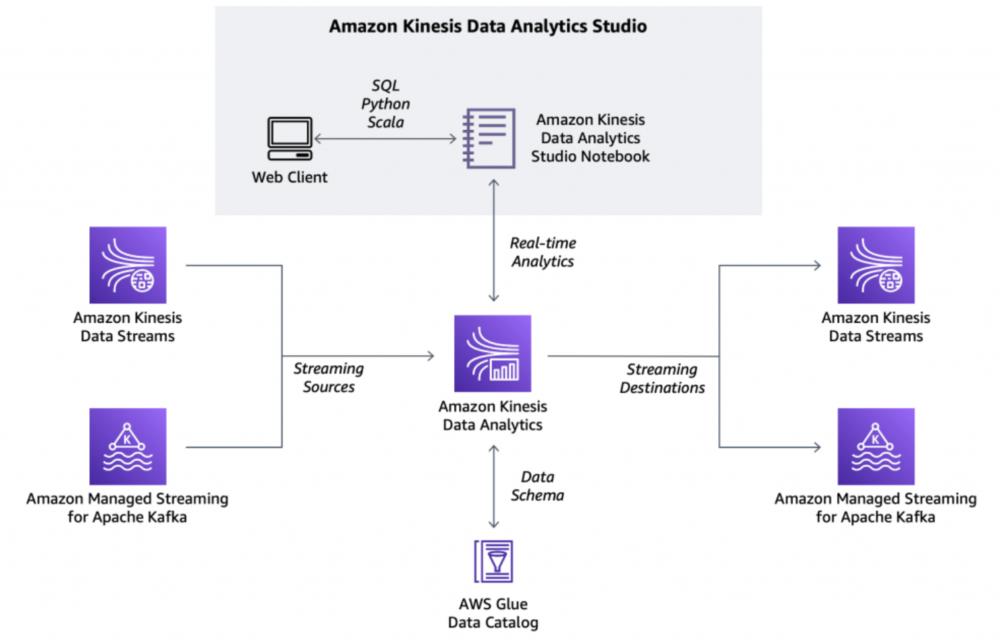

# 目次
- [目次](#目次)
- [目的](#目的)
- [背景](#背景)
- [参考](#参考)
- [内容](#内容)
  - [Data Engineering](#data-engineering)
    - [AWS Kinesis](#aws-kinesis)
    - [AWS Glue](#aws-glue)
  - [Other](#other)
    - [検証環境と商用環境におけるMLパイプラインの違いは何か？](#検証環境と商用環境におけるmlパイプラインの違いは何か)
    - [Amazon SageMaker各種サービスについて](#amazon-sagemaker各種サービスについて)
    - [Amazon SageMakerネットワーク設計パターン](#amazon-sagemakerネットワーク設計パターン)
# 目的
- AWSのML関連の知識習得
# 背景
- ML/分析関連のPJに関わり始めて一年になる
- 今のPJのアーキテクチャの理解を深める
- ML/分析関連のアーキテクチャ(ex.MLパイプラインなど)のベスプラを理解し、今のPJのアーキテクチャに不足している部分を洗い出す
- 今後ゼロからML/分析関連のアーキテクチャを構築する場合、どのような考慮事項があるか網羅的に学んでおきたい
# 参考
- [AWS Certified Machine Learning Specialty 2023 - Hands On!](https://www.udemy.com/course/aws-machine-learning/)
- [2021年05月時点で自分が実践しているMLOpsの情報収集方法](https://shunyaueta.com/posts/2021-05-29/)
- [機械学習のルール](https://developers.google.com/machine-learning/guides/rules-of-ml)
- [MLOps: 機械学習における継続的デリバリーと自動化のパイプライン](https://cloud.google.com/architecture/mlops-continuous-delivery-and-automation-pipelines-in-machine-learning)
- 
- 
# 内容
## Data Engineering
### AWS Kinesis
- Overview
  - Kinesis is a managed alternative to Apache Kafka
    - (Apache Kafka is an open-source distributed event streaming platform (also known as a “pub/sub” messaging system) that brokers communication between bare-metal servers, virtual machines, and cloud-native services.)
  - Great for application logs, metrics, IoT, clickstreams
  - Great for real-time big data
  - Great for streaming processing frameworks (Spark, NiFi, etc...
- Capabilities
  - Kinesis Data Streams: low latency streaming ingest at scale
    - [details](https://docs.aws.amazon.com/streams/latest/dev/key-concepts.html)
    - 

  - Kinesis Data Analytics: perform real-time analytics on streams using SQL
    - Use cases
      - Streaming ETL: select columns, make simple transformations, on streaming data
      - Continuous metric generation: live leaderboard for a mobile game
      - Responsive analytics: look for certain criteria and build alerting (filtering)
    - [リアルタイム分析がやりたい！はじめての Kinesis Data Analytics](https://dev.classmethod.jp/articles/first-time-kinesis-data-analytics/)
    - [Kinesis Data Analytics Studioでストリーミングデータを可視化してみた](https://dev.classmethod.jp/articles/visualize_with_kinesis-data-analytics-studio/)
    - 

  - Kinesis Data Firehose: load streams into S3, Redshift, ElasticSearch & Splunk
    - 

  - Kinesis Video Streams: meant for streaming video in real-time
    - [AWS IoT 再入門ブログリレー Amazon Kinesis Video Streams編](https://dev.classmethod.jp/articles/re-introduction-iot-2021-amazon-kinesis-video-streams/)
    - 

- Architecture
  - [Amazon Kinesis Data Analytics Studio の概要 – SQL、Python、または Scala を使用してストリーミングデータをすばやく操作する](https://aws.amazon.com/jp/blogs/news/introducing-amazon-kinesis-data-analytics-studio-quickly-interact-with-streaming-data-using-sql-python-or-scala/)
  - 

### AWS Glue
- Overview
  - Discover and organize data
  - Transform, prepare, and clean data for analysis
  - Build and monitor data pipelines
- Components
  - console
  - Data Catalog
  - crawler and classifiers
  - ETL operations
  - jobs system (workflow)
- Architecture
  - 

  - [AWS Black Belt Online Seminar](https://pages.awscloud.com/rs/112-TZM-766/images/AWS-Black-Belt_2023_AWS-Glue_0331_v1.pdf)
- ref
  - [AWS再入門ブログリレー2022 AWS Glue編](https://dev.classmethod.jp/articles/re-introduction-2022-aws-glue/)
## Other
### 検証環境と商用環境におけるMLパイプラインの違いは何か？
- ChatGPTの回答
  - 検証環境と商用環境におけるMLパイプラインの違いは、主に以下のような点があります。
      - 数量の差: 検証環境では、少量のデータを使用してモデルを開発し、評価するために使用されます。 一方、商用環境では、大量のデータを処理し、大規模なインフラストラクチャを使用して運用されます。
      - 要件の差: 検証環境では、モデルの性能を測定するために、準確性や精度などのメトリクスが重視されます。一方、商用環境では、実際のビジネスニーズに合わせて、スケーラビリティや可用性などの要件が重視されます。
      - セキュリティーの差: 検証環境では、データのセキュリティーは重視されませんが、商用環境では、顧客データなどの個人情報の保護が求められるため、より高いセキュリティーが求められます。
      - 公開の差: 検証環境では、結果や処理結果は限られたチームや関係者にのみ公開されます。 一方、商用環境では、顧客や消費者に対して公開されるため、準確性や品質が高くなければならないです。
  - また、検証環境では、実験的なアプローチを取り、多くのパラメータを試すことができますが、商用環境では、実用性を考慮し、最適なパラメータを選択することが求められます。
  - 検証環境と商用環境では、それぞれ異なるニーズに対応しなければならないため、それぞれ独自のMLパイプラインを構築する必要があります。
- GCPの図的に表してたやつ
  - [MLOps: 機械学習における継続的デリバリーと自動化のパイプライン](https://cloud.google.com/architecture/mlops-continuous-delivery-and-automation-pipelines-in-machine-learning)
  - 

### Amazon SageMaker各種サービスについて
- [Amazon SageMakerサービスまとめ](https://qiita.com/knowledgecommunication/items/1350af15e8adda0971ae)
- [AWS再入門ブログリレー2022 Amazon SageMaker 編](https://dev.classmethod.jp/articles/re-introduction-2022-sagemaker/)
- [[Amazon SageMaker Data Wrangler] 機械学習用データを簡単で最速に準備できる機能を使ってみた](https://dev.classmethod.jp/articles/amazon-sagemaker-data-wrangler-with-demo-titanic/)
- [Amazon SageMaker Data Wrangler が Amazon EMR Presto をビッグデータクエリエンジンとしてサポート](https://aws.amazon.com/jp/about-aws/whats-new/2022/12/sagemaker-data-wrangler-supports-amazon-emr-presto-data-source-query-engine/)
- [Amazon SageMaker による実験管理](https://pages.awscloud.com/rs/112-TZM-766/images/202207_AWS_Black_Belt_AWS_AIML_Dark_02_Experiments_Management.pdf)
  - 
- 
- 
### Amazon SageMakerネットワーク設計パターン
- [【Amazon SageMaker】ネットワーク設計パターンをまとめてみた](https://dev.classmethod.jp/articles/sagemaker-network-vpc-architecture-2022-04/)
- [閉域網で Amazon SageMaker を利用する際のポイントと手順](https://aws.amazon.com/jp/blogs/news/internet-free-sagemaker/)