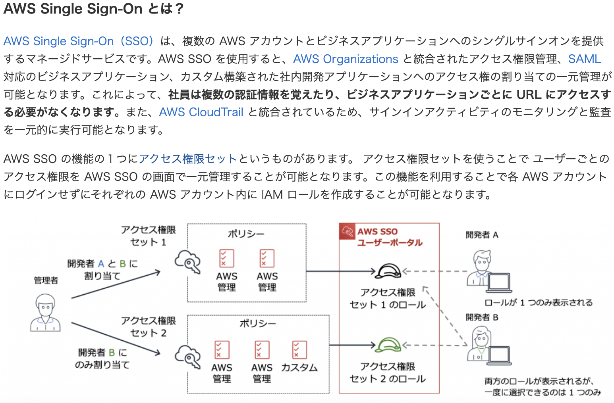

# 目次
- [目次](#目次)
- [目的](#目的)
- [背景](#背景)
- [参考](#参考)
- [内容（知らなかったことを箇条書きしておく）](#内容知らなかったことを箇条書きしておく)
  - [VPCフローログの見方](#vpcフローログの見方)
  - [ELBとRoute53のヘルスチェック機能の違い](#elbとroute53のヘルスチェック機能の違い)
  - [Lambdaのスケーリング](#lambdaのスケーリング)
  - [S3バケット・オブジェクトの削除](#s3バケットオブジェクトの削除)
  - [AWS \<Service/Personal\> Health Dasheboard](#aws-servicepersonal-health-dasheboard)
  - [AWS Organizationの機能セット](#aws-organizationの機能セット)
  - [EBSストレージサイズ変更](#ebsストレージサイズ変更)
  - [Amzon ElastiCache](#amzon-elasticache)
  - [EC2インスタンスのコスト削減](#ec2インスタンスのコスト削減)
  - [AWS SSOの管理方法](#aws-ssoの管理方法)
  - [アイデンティティベースおよびリソースベースのポリシー](#アイデンティティベースおよびリソースベースのポリシー)
  - [S3のクロスアカウントアクセス](#s3のクロスアカウントアクセス)
  - [ネットワークに関するログ](#ネットワークに関するログ)
  - [AWSリソースのサービス制限の状況を確認するサービス](#awsリソースのサービス制限の状況を確認するサービス)
  - [Auto Scaling](#auto-scaling)
  - [Cfnのデプロイ失敗時のトラブルシュート](#cfnのデプロイ失敗時のトラブルシュート)
  - [Auto Scalingのヘルスチェック](#auto-scalingのヘルスチェック)
    - [](#)

# 目的
- AWSのOperation/Security/Governance関連の知識習得

# 背景
- 業務では付加価値に直結するサービス開発にばかり従事しているため習得機会がない
- 一方で、長期的なサービス稼働・運用を考慮するとOperation/Security/Governanceは運用コストに大きく関わってくるためベスプラを学んでおきたい

# 参考
- [AWS認定資格試験テキスト AWS認定SysOpsアドミニストレーター - アソシエイト AWS認定資格試験テキスト](https://www.amazon.co.jp/AWS%E8%AA%8D%E5%AE%9A%E8%B3%87%E6%A0%BC%E8%A9%A6%E9%A8%93%E3%83%86%E3%82%AD%E3%82%B9%E3%83%88-AWS%E8%AA%8D%E5%AE%9ASysOps%E3%82%A2%E3%83%89%E3%83%9F%E3%83%8B%E3%82%B9%E3%83%88%E3%83%AC%E3%83%BC%E3%82%BF%E3%83%BC-%E3%82%A2%E3%82%BD%E3%82%B7%E3%82%A8%E3%82%A4%E3%83%88-NRI%E3%83%8D%E3%83%83%E3%83%88%E3%82%B3%E3%83%A0%E6%A0%AA%E5%BC%8F%E4%BC%9A%E7%A4%BE/dp/481560908X)


# 内容（知らなかったことを箇条書きしておく）
## [VPCフローログの見方](https://qiita.com/miyuki_samitani/items/f83bc082156a36770828)
## ELBとRoute53のヘルスチェック機能の違い
- ELB
    - http/httpsを指定している場合パスを指定してヘルスチェック可能
        - [ターゲットグループのヘルスチェック](https://docs.aws.amazon.com/ja_jp/elasticloadbalancing/latest/application/target-group-health-checks.html)
    - ステータスコードの確認のみ
- Route53
    - ELBのヘルスチェック機能をドメイン名にも適用させてようなかんじ
    - ステータスコード+サイト文字列の確認
    - ターゲットにIPまたはドメイン名指定可能
- ref
    - [ELBとRoute 53のヘルスチェック仕様の違い](https://dev.classmethod.jp/articles/health-check-spec-elb-route53/)

## Lambdaのスケーリング
- 垂直スケーリング：メモリ増やす
- 水平スケーリング：[同時実行数の予約](https://docs.aws.amazon.com/ja_jp/lambda/latest/dg/configuration-concurrency.html)

## S3バケット・オブジェクトの削除
- バケット削除
    ```
    aws s3 rb <S3URI>
    ```
- オブジェクト削除
    ```
    aws s3 rm <S3URI>
- バケット削除を実行してもバケットが残るパターン
    - バージョニングを有効にしていたとき
        - オブジェクトは削除マーカーのついたオブジェクトとして残る。ただし、存在しないように見える。
        - バケットは↑のバージョニングされたオブジェクトが残っているので、削除されない。
        - 空のバケットが残ってるかんじ

## AWS <Service/Personal> Health Dasheboard
- AWS Service Health Dasheboard
    - AWSサービス全体の状態をまとめているサービス（どのリージョンでどんな障害が起きているとか）
- AWS Service Personal Dasheboard
    - AWSアカウント内で利用しているサービス・リージョン・リソースなどの状態がわかるサービス

## AWS Organizationの機能セット
- 一括請求機能（Consolidated Billing）
    - メンバーアカウントの請求管理のみを管理アカウントに統合することができる
- すべての機能
    - メンバーアカウントの請求管理のAWSリソース権限管理なども管理アカウントに統合することができる
- 請求管理は統合したいがAWSリソース管理は独立させたい場合一括請求機能が適切
- 「一括請求機能」から「すべての機能」へは後からも変更できる
- ref
    - [組織内のすべての機能の有効化](https://docs.aws.amazon.com/ja_jp/organizations/latest/userguide/orgs_manage_org_support-all-features.html)

## EBSストレージサイズ変更
- ストレージサイズ大きくした場合、EC2のOSでボリュームのファイルシステムを拡張する（マウントする）必要がある

## Amzon ElastiCache
- MemcachedまたはRedisプロトコルに準拠したインメモリデータベース
- セッション管理やRDS、Auroraのデータのキャッシュによく利用される
- クラスタ構成が推奨される
- スケーリングについて
    - Memcache
        - シンプル
        - ノードを追加することで水平スケーリング可能
        - ノードサイズを変更して垂直スケーリングする場合は新しく作る必要がある
    - Redis
        - 多機能
        - ノードを追加することで水平スケーリング可能
        - ノードサイズを変更して垂直スケーリングも可能
        - 非同期でのリードレプリカ可能

- 障害時の挙動
    - インスタンスで障害が発生すると自動でF/Oしノードが置き換わる
    - Memcache/Redisそれぞれで挙動が少し異なる
        - Memcahce
            - 障害ノードをクラスタが自動検出し、新規ノードに置き換える
        - Redis
            - 障害ノードがプライマリノードかリードレプリカによって挙動が異なる
            - プライマリノードの場合
                - 書き込み処理が一時的にできなくなる（唯一書き込みができるインスタンスなので）
                - リードレプリカから自動で選択されたものが昇格しプライマリインスタンスとなる
                    - 自動なのでプライマリインスタンスのエンドポイントの切り替えは不要
            - リードレプリカの場合
                - 読み込み処理はプライマリインスタンスが請け負うため影響はなし
                - 新しいリードレプリカ起動時にその読み込み先を手動で切り替える必要がある

- モニタリング
    - メトリクス
        1. CPU使用率 
        2. Eviction（キャッシュメモリ不足起因のキャッシュアウト発生回数）
            - 新しい書き込みスペースを確保するために有効期限がまだあるアイテムがキャッシュから削除された数
        3. スワップ使用量
        4. キャッシュヒット・ミス数
        5. メモリ使用量
        6. レプリケーション遅延時間
        - 4-6はRedisのみに存在

## EC2インスタンスのコスト削減
- EC2の主な[購入オプション](https://docs.aws.amazon.com/ja_jp/AWSEC2/latest/UserGuide/instance-purchasing-options.html)は下記
    1. オンデマンドインスタンス
    1. リザーブドインスタンス
        - 一定期間の継続利用を前提に支払い契約をすることで大幅な割引が適用されるもの
    1. スポットインスタンス
        - AWS上で使用されていない予備のEC2をリクエストする
        - 大幅なコスト削減が期待できる反面、予備のEC2のキャパシティが利用できなくなったりスポット料金が上限価格を超過した場合インスタンスが中断するリスクがある
        - 起動方法は4つあり、上記のリスク回避ができる起動方法もある
            1. スポットインスタンス単体
            1. スポットフリート
                - スポットインスタンスをまとめて起動・管理
            1. EC2フリート
                - オンデマンド+スポットで起動・管理
                - 同期処理や最小起動台数の保証が可能
            1. EC2 Auto Scaling
                - 動的スケーリング
                - フリートと組みわせることも可能
- [オプションごとのユースケース](https://dev.classmethod.jp/articles/ec2-purchasing-deep-divereinvent/)
    1. オンデマンドインスタンス
        - 初めて利用する
        - 予測できないワークロードアプリケーション
    1. リザーブドインスタンス
        - 常時起動または予測可能な使用をするアプリケーション
        - 長期的なコミットメントができ割引のために前払いができるユーザ
    1. スポットインスタンス
        1. スポットインスタンス単体
            - 安定性をあまり求めない短時間で終了するワークロード処理
- その他ユースケース
    1. 安定性を確保しながら3hのバッチ処理を日次で実施したい
        - EC2オンデマンドインスタンスをEventBridgeとLambdaで指定時間のみ起動させる
- ref
    - [AWSを活用してゲームサーバーのコストを劇的に下げるスポットインスタンスを効果的に使うための基礎知識](https://logmi.jp/tech/articles/321685)
    - [AWSコスト削減のためのスポットインスタンス活用術](https://www.stylez.co.jp/columns/how_to_use_spot_instances_to_reduce_aws_costs/#i-7)
## AWS SSOの管理方法
- アクセス権限セットを使用して管理アカウントからユーザーごとのアクセス権限を一元管理する
    - AWS SSOで設定したアクセス権限セットは、AWSアカウントではIAMロールとして設定されユーザーに複数割り当てることが可能
    - ユーザーはそこから1つのアクセス権限セット（IAMロール）を選択してAWS SSOユーザポータルにサインインする
<p align='center'></p>

- ref
    - [え、IAM ユーザーを作らなくてもマネジメントコンソールにログインできるの!? – シングルサインオン考え方編](https://aws.amazon.com/jp/blogs/startup/techblog-iam-sso-concept/)
## [アイデンティティベースおよびリソースベースのポリシー](https://docs.aws.amazon.com/ja_jp/IAM/latest/UserGuide/access_policies_identity-vs-resource.html)
- AWSのポリシーには大きく２種類存在
    1. アイデンティティベース
        - IAMユーザー・グループ・ロールにアタッチされるもの
    1. リソースベース
        - S3のバケットポリシーなどAWSリソースにアタッチされるもの
        - どんなのがあるかは[IAMと連携するAWSのサービス](https://docs.aws.amazon.com/ja_jp/IAM/latest/UserGuide/reference_aws-services-that-work-with-iam.html)参照
## S3のクロスアカウントアクセス
- S3バケットのアクセス制御をする機能
    1. リソースベース
        1. ACL
        1. バケットポリシー
        1. アクセスポイント
    1. アイデンティティベース
        1. IAM
- クロスアカウントの設定には次のいずれかを使用する
    1. アイデンティティベース+リソースベース
        1. アクセス先のAWSアカウントのS3バケットのバケットポリシーで、アクセス元のAWSアカウントのIAMロールまたはIAMユーザーのアクセスを許可する
        2. アクセス先のAWSアカウントのS3バケットのACLで、アクセス元のAWSアカウント空のアクセスを許可する
    2. アイデンティティベースのみ
        1. アクセス先のAWSアカウントのIAMロールで、アクセス元のAWSアカウント空のクロスアカウントIAMロールを引き受ける許可をする
    - 選定基準
        >- すべての AWS サービスがリソースベースのポリシーをサポートしているわけではありません。そのため、複数のサービスへのクロスアカウントアクセスを提供するときに、クロスアカウントの IAM ロールを使用してアクセス許可の管理を一元化できます。
    - ref
        - [Simple Storage Service (Amazon S3) バケット内のオブジェクトへのクロスアカウントアクセスを提供するにはどうすればよいですか?](https://aws.amazon.com/jp/premiumsupport/knowledge-center/cross-account-access-s3/)
## ネットワークに関するログ
- webアプリケーションをCloutFront,ALB,EC2,RDSで構成している場合、ネットワークに関するログはどこからどんな情報が取得できるか
    - CloudFront
        - HTTP/HTTPSのステータスコード(L7)
    - ALB
        - HTTP/HTTPSのステータスコード(L7)
    - VPC
        - IPトラフィックログ(L4)


## AWSリソースのサービス制限の状況を確認するサービス
1. AWS Trusted Advisor
    - ベストプラクティスをもとにパフォーマンス・セキュリティ・耐障害性・サービスの制限に関する斉唱事項をチェックするサービス
    - CloudWatchと連携すると、サービス制限の使用率を閾値にしてアラート作成が可能（ビジネス・エンタープライズサポートプラン）
1. AWS Service Quotas
    - サービス制限値の確認と上限緩和申請をするサービス
    - CloudWatchと連携すると、サービス制限の制限値を閾値にしてアラート作成が可能
## Auto Scaling
- ライフサイクルフック
    - ASGでスケールアウト/インが発生した時にインスタンスが追加/削除される前に実行されるフックイベント
## Cfnのデプロイ失敗時のトラブルシュート
- スタックを作成したIAMユーザーに、スタック内のAWSリソースに対する権限がない
- Cfnサービスロールに、スタック内のAWSリソースに対する権限がない
- 他のリージョンではデプロイできていたテンプレートがデプロイに失敗した場合なども上記が考えられる
    - 他のリージョンにはないAWSサービスが記載されている場合もあり得る
## Auto Scalingのヘルスチェック
1. EC2ステータスヘルスチェック（デフォルト）
    - インスタンスが実行中であるかどうか
    - ハードウェア・OS・リソースの過剰使用率をチェック
1. ELBヘルスチェック
    - 詳細は[ELBとRoute53のヘルスチェック機能の違い](#elbとroute53のヘルスチェック機能の違い)
2. カスタムヘルスチェック
    - 詳細はref参照
- ref
    - [Auto Scaling インスタンスのヘルスチェック](https://docs.aws.amazon.com/ja_jp/autoscaling/ec2/userguide/ec2-auto-scaling-health-checks.html)

###
