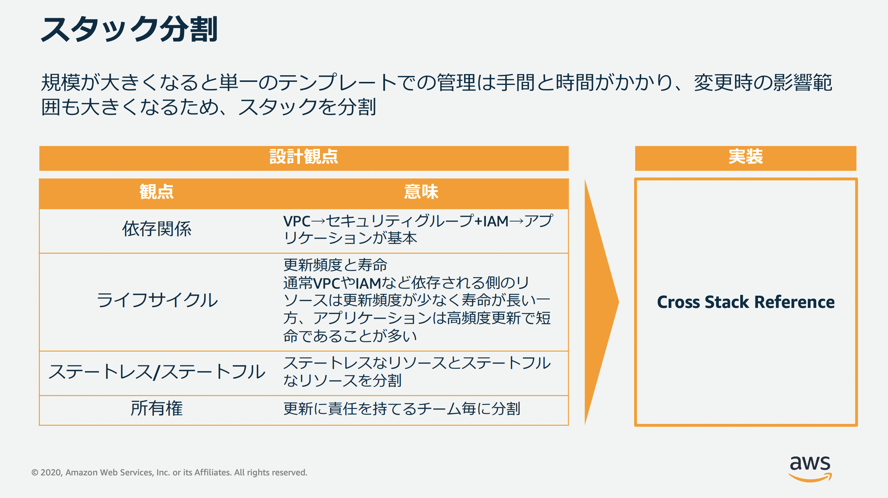

# 目次
- [目次](#目次)
- [目的](#目的)
- [背景](#背景)
- [参考](#参考)
- [内容](#内容)
# 目的
- Cfnの設計思想を理解し、拡張性・運用保守性のあるIaCを作成できるようにするため
# 背景
- IaC使っているけど小さい規模のシステムを作る際に使っているくらいでスタックを分けたこともマッピングを利用したこともない
- 組み込み関数!Ref,!GetAttを使用したぐらい...
- なので、設計思想をきちんと学習した上で大きいシステムのIaCがどうあるべきか学んでおきたい
# 参考
- [AWS Black Belt Online Seminar AWS CloudFormation](https://pages.awscloud.com/rs/112-TZM-766/images/20200826_AWS-BlackBelt_AWS-CloudFormation.pdf)
- [AWS Black Belt Online Seminar AWS CloudFormation deep dive](https://pages.awscloud.com/rs/112-TZM-766/images/20201006_BlackBelt_CloudFormation_DeepDive.pdf)

# 内容
- ライフサイクル別のテンプレート管理
  - 

  - 

  - 

  - 

  - 

  - 

- スタックの整理
  - 下記2つの一般的なフレームワークを使用できる
    - 多層アーキテクチャー
      - 多層アーキテクチャーは、スタックを積み上げて構築する複数の水平の層に整理します。各層はその直下の層に依存します。各層には 1 つ以上のスタックを持つことができますが、各層のスタックは類似したライフサイクルと所有権を持つ AWS リソースを持つ必要があります。
      - ref
        - [CloudFormationの実践ベストプラクティス](https://qiita.com/uramotot/items/4a55ccad14f44f5006f6#my-cloudformation%E3%83%99%E3%82%B9%E3%83%88%E3%83%97%E3%83%A9%E3%82%AF%E3%83%86%E3%82%A3%E3%82%B9%E3%81%AE%E6%A7%8B%E6%88%90)
        - [CloudFormationのベストプラクティスを整理する](https://zenn.dev/trkdkjm/articles/728cac0bbb8119)
    - サービス指向アーキテクチャー(SOA)
      - サービス指向アーキテクチャーを使用すると、業務上の大きな問題を処理しやすい大きさに整理できます。これらのパートはそれぞれ、明確に定義された目的があり、機能の自己充足単位を表します。これらのサービスを、それぞれ独自のライフサイクルと所有者があるスタックにマッピングできます。これらのサービス (スタック) を 1 つに繋いで、相互に通信するようにできます。