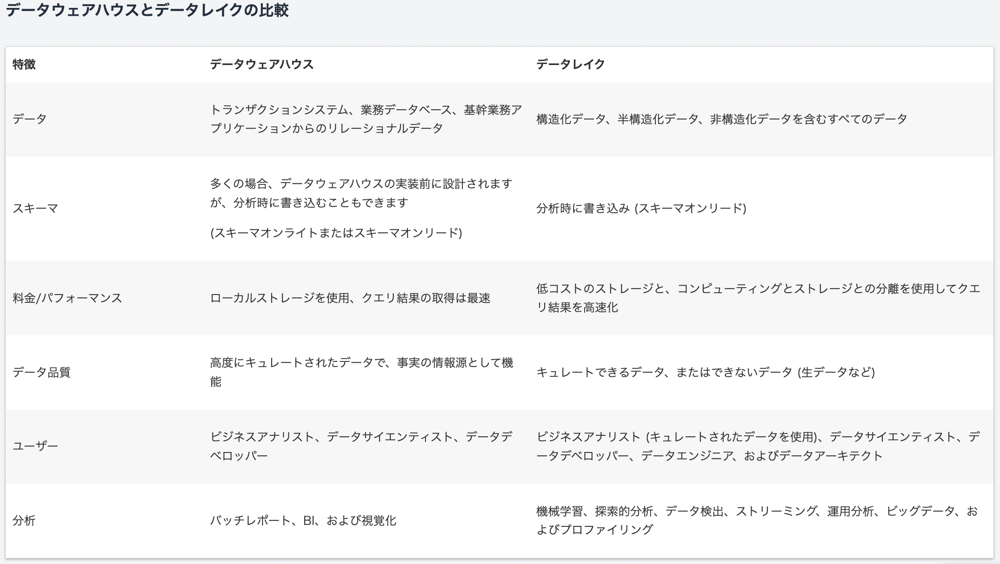
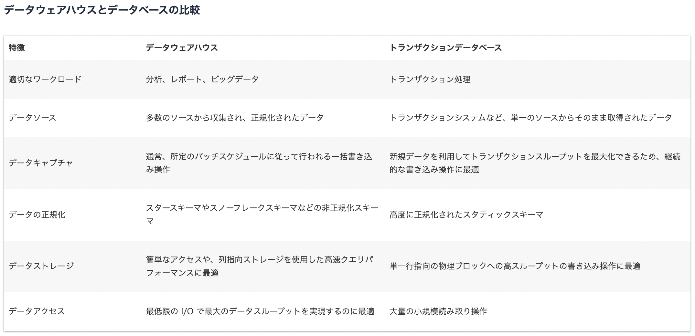
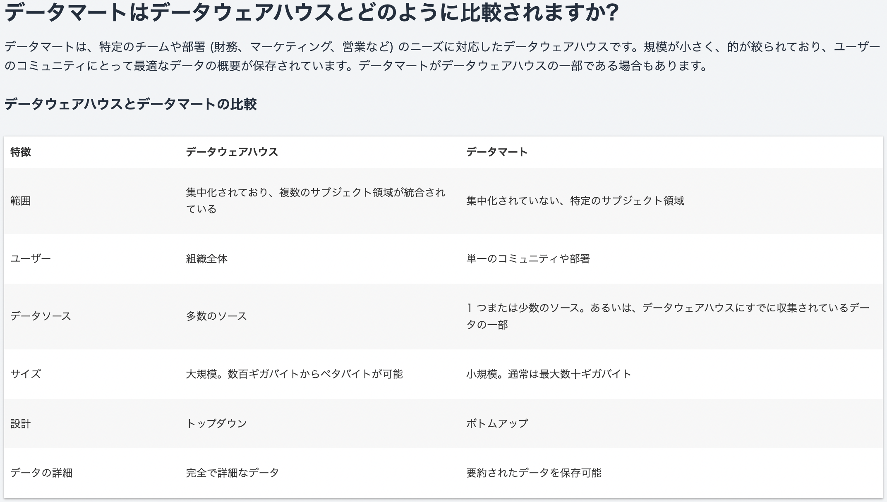

# 目次
- [目次](#目次)
- [目的](#目的)
- [背景](#背景)
- [参考](#参考)
- [内容](#内容)
# 目的
- dwhの概要・各製品の特徴・メリデメの理解
# 背景
- クライアントからの製品選定の要望があった
- パブリッククラウドのdwhサービス以外のものを知っておきたい(i.e. databricks,snowflake)
# 参考
# 内容
- [データウェアハウスの概念](https://aws.amazon.com/jp/data-warehouse/)
  - 

  - 

  - 

- [Snowflake vs BigQuery 202111](https://www.integrate.io/blog/snowflake-vs-bigquery/)
- [Redshift vs BigQuery 202201](https://www.integrate.io/blog/redshift-vs-bigquery-comprehensive-guide/)
- [Redshift vs Snowflake 202301](https://www.integrate.io/jp/blog/redshift-vs-snowflake-difference-ja/)
- [Snowflake vs Redshift vs BigQuery。その違いは？](https://note.com/zuruzirou/n/nef66a8d9de98)