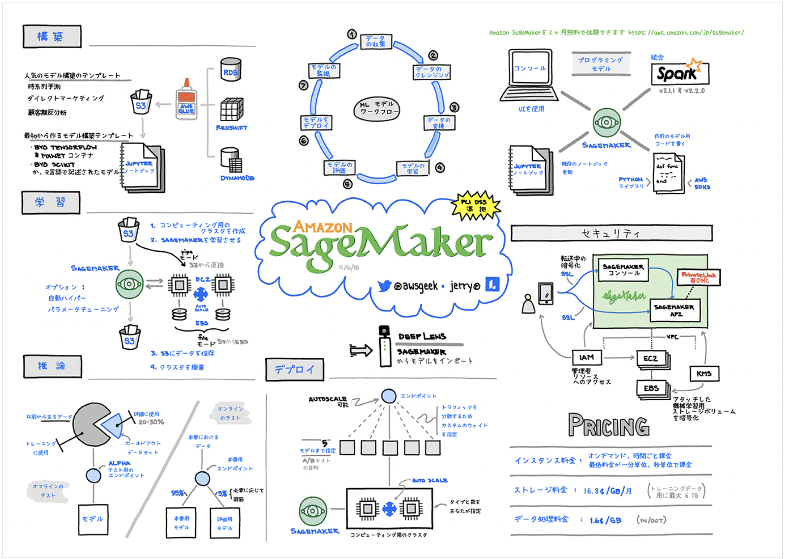
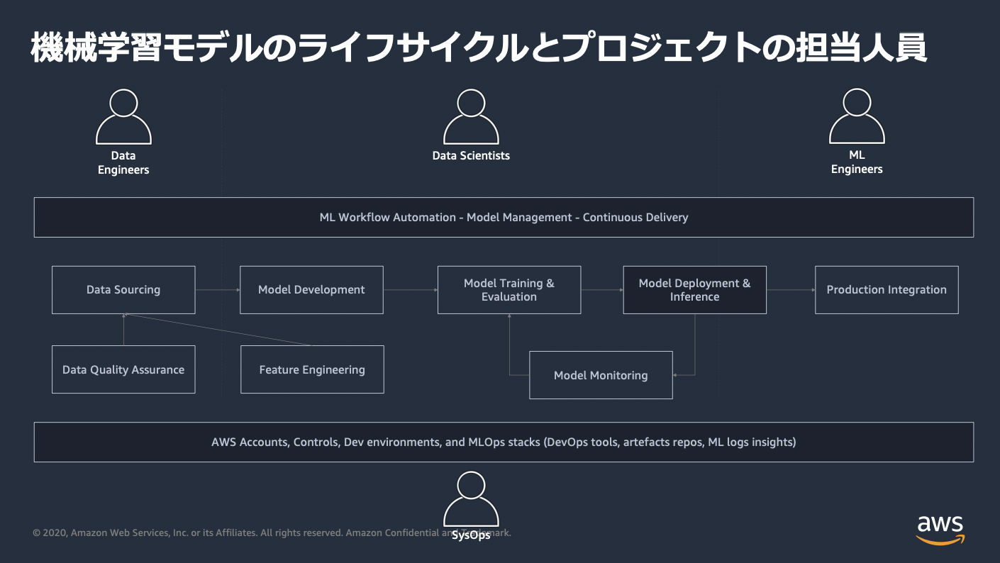
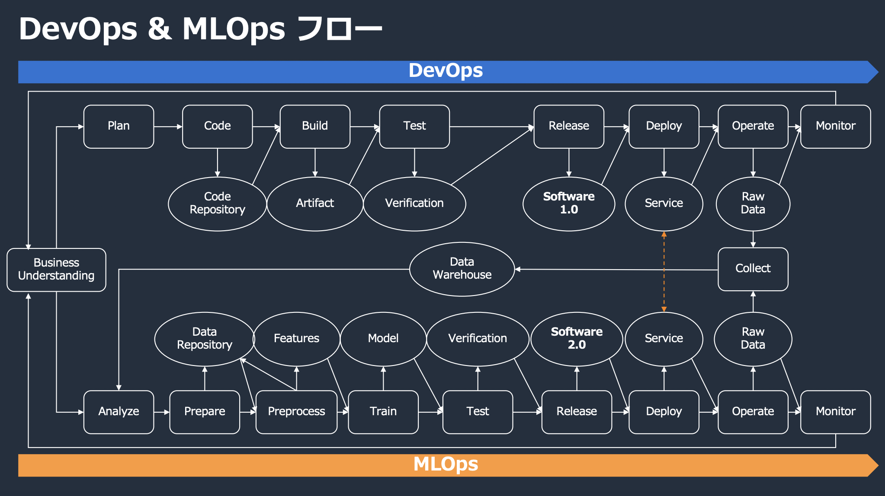
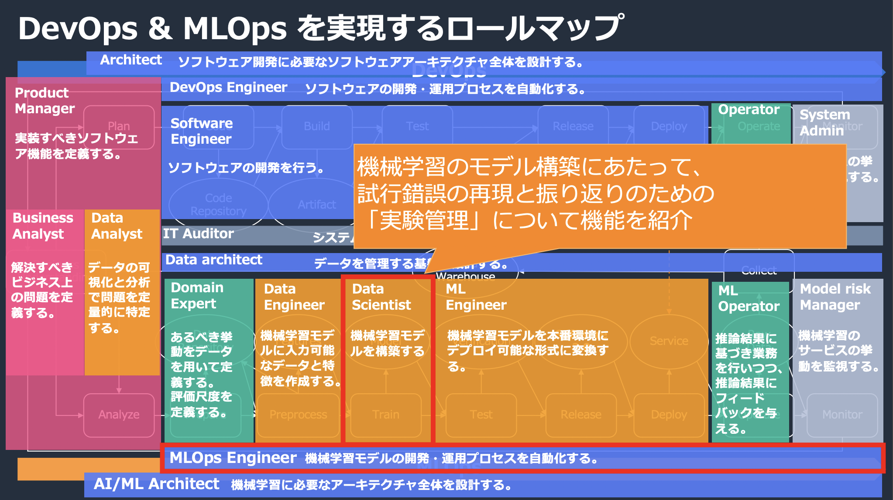
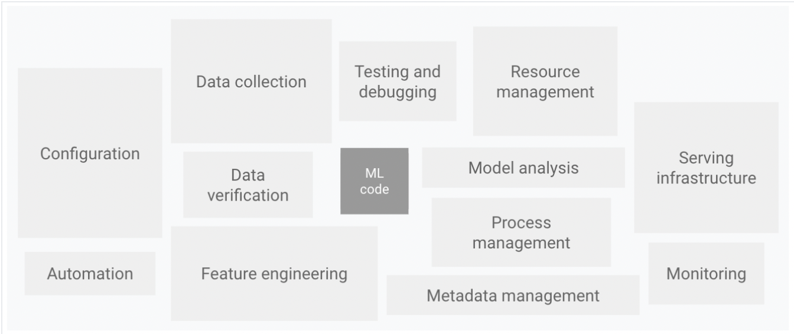
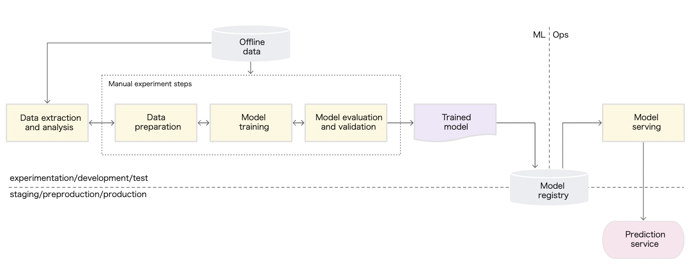
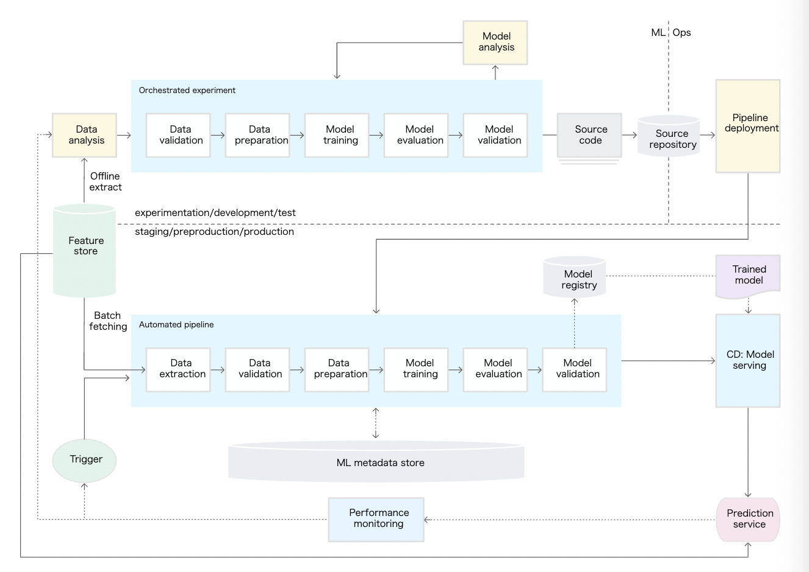
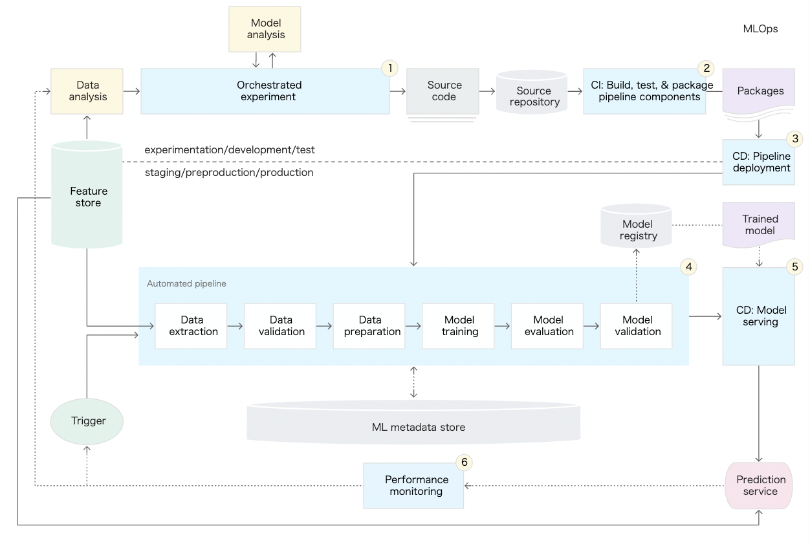

# 目次
- [目次](#目次)
- [目的](#目的)
- [背景](#背景)
- [参考](#参考)
- [内容](#内容)
# 目的
- MLOpsの理解度向上
- AI/MLシステムにかかわる各ロールの違いや実施していることを俯瞰的に理解すること
# 背景
- 分析関係のプロジェクトにアサインされたため
- 今後AL/MLシステムの専門性に富んだエンジニアになりたいため
# 参考
- 書籍
  - [仕事ではじめる機械学習](https://www.amazon.co.jp/%E4%BB%95%E4%BA%8B%E3%81%A7%E3%81%AF%E3%81%98%E3%82%81%E3%82%8B%E6%A9%9F%E6%A2%B0%E5%AD%A6%E7%BF%92-%E7%AC%AC2%E7%89%88-%E6%9C%89%E8%B3%80-%E5%BA%B7%E9%A1%95/dp/4873119472)
  - [機械学習デザインパターン](https://www.amazon.co.jp/%E6%A9%9F%E6%A2%B0%E5%AD%A6%E7%BF%92%E3%83%87%E3%82%B6%E3%82%A4%E3%83%B3%E3%83%91%E3%82%BF%E3%83%BC%E3%83%B3-%E2%80%95%E3%83%87%E3%83%BC%E3%82%BF%E6%BA%96%E5%82%99%E3%80%81%E3%83%A2%E3%83%87%E3%83%AB%E6%A7%8B%E7%AF%89%E3%80%81MLOps%E3%81%AE%E5%AE%9F%E8%B7%B5%E4%B8%8A%E3%81%AE%E5%95%8F%E9%A1%8C%E3%81%A8%E8%A7%A3%E6%B1%BA-Valliappa-Lakshmanan/dp/4873119561)
  - [実践AWSデータサイエンス](https://www.amazon.co.jp/%E5%AE%9F%E8%B7%B5-AWS%E3%83%87%E3%83%BC%E3%82%BF%E3%82%B5%E3%82%A4%E3%82%A8%E3%83%B3%E3%82%B9-%E2%80%95%E3%82%A8%E3%83%B3%E3%83%89%E3%83%84%E3%83%BC%E3%82%A8%E3%83%B3%E3%83%89%E3%81%AEMLOps%E3%83%91%E3%82%A4%E3%83%97%E3%83%A9%E3%82%A4%E3%83%B3%E5%AE%9F%E8%A3%85-Chris-Fregly/dp/4873119685)
- その他ドキュメント
# 内容
- AI/MLシステムの基本的なワークフロー
  - 

  - ref
    - [GoogleCloudで機械学習を実装するためのベストプラクティス](https://cloud.google.com/architecture/ml-on-gcp-best-practices?hl=ja#machine-learning-workflow-orchestration)
    - [機械学習のワークフローってどうなっているの ? AWS の機械学習サービスをグラレコで解説](https://aws.amazon.com/jp/builders-flash/202003/awsgeek-sagemaker/?awsf.filter-name=*all)
- AI/MLシステムにかかわる人員と役割（呼び方は色々あると思う。。。）
  1. Data Scientist/ML Engineer
    - 探索的データ分析を実施する人達
      - 特徴量エンジニアリング
      - モデル開発（加工/探索/訓練/評価）
  2. Data Engineer
    - データエンジニアリングする人達
      - データ収集
      - ETL
  3. Cloud/Platform/Software/MLOps/SysOps Engineer
    - 上記をクラウドサービス等を用いてシステムとして構築・管理する人達
        - システム化
        - パイプライン化
        - セキュリティ
        - ガバナンス
        - その他諸々
   - 

   - ref
     - [AWSで構築するMLOps基盤](https://pages.awscloud.com/rs/112-TZM-766/images/20201015_AWS%E3%81%A6%E3%82%99%E6%A7%8B%E7%AF%89%E3%81%99%E3%82%8BMLOps%E5%9F%BA%E7%9B%A4_%E9%85%8D%E5%B8%83%E7%89%88__AIMLTokyo7.pdf)
   - 

   - 

- 他のシステムにはないAL/MLシステムの特徴
  - チームのスキル:
    > ML プロジェクトのチームには通常、探索的データ分析、モデル開発、テストに注力するデータ サイエンティストや ML 研究者が含まれます。これらのメンバーが、本番環境クラスのサービスをビルドできる経験豊富なソフトウェア エンジニアではない場合があります。
  - 開発
    > ML には実験的性質があります。さまざまな機能、アルゴリズム、モデリング技術、パラメータ構成を試して、問題に最適な方法をできるだけ早く見つける必要があります。何が機能し、何が機能しなかったかを追跡して、コードの再利用性を最大化しながら再現性を維持することが課題となります。
  - テスト
    > ML システムのテストは、その他のソフトウェア システムのテストよりも複雑です。一般的な単体テストと統合テストに加えて、データ検証、トレーニングされたモデル品質評価、モデル検証が必要です。
  - デプロイ
    > ML システムでのデプロイは、予測サービスとしてオフラインでトレーニングした ML モデルのデプロイのようにシンプルではありません。ML システムでは、マルチステップ パイプラインをデプロイして、デプロイモデルを自動的に再トレーニングする必要があります。このパイプラインにより複雑さが増し、データ サイエンティストによるデプロイの前に手動で行われる手順を自動化して、新しいモデルのトレーニングと検証をする必要があります。
  - 本番環境
    > ML モデルは、最適化されていないコーディングだけでなく、絶えず変化するデータ プロファイルのためにパフォーマンスが低下する可能性があります。つまり、従来のソフトウェア システムよりも多くの方法でモデルが劣化する可能性があるため、このような性能低下を考慮する必要があります。そのため、データの概要統計を追跡し、モデルのオンライン パフォーマンスをモニタリングして、値が想定と異なる場合に通知を送信またはロールバックする必要があります。
  - ref
      - [MLOps:機械学習における継続的デリバリーと自動化のパイプライン](https://cloud.google.com/architecture/mlops-continuous-delivery-and-automation-pipelines-in-machine-learning)
- MLOpsとは
  - AI/MLシステムにおけるDevOpsこと
    - 一般的なDevOpsとの違いはCI/CDにCT(Continuos Training)があること
  - なんでMLOpsが必要か
    - AL/MLシステムはMLコードだけでなく様々な技術的要素が複合的に絡むシステムであるため、継続的に運用することが困難
    - 継続的な運用を可能にするためにDevOpsをAL/MLシステムに適用したもの=MLOps
      - 

      - ref
        - [Hidden Technical Debt in Machine Learning Systems](https://proceedings.neurips.cc/paper/2015/file/86df7dcfd896fcaf2674f757a2463eba-Paper.pdf)
  - MLOpsレベル
    - MLOpsレベル0:手動
      - 

    - MLOpsレベル1:MLパイプラインの自動化
      - 

    - MLOpsレベル2:CI/CDパイプラインの自動化
      - 

    - ref
      - [MLOps:機械学習における継続的デリバリーと自動化のパイプライン](https://cloud.google.com/architecture/mlops-continuous-delivery-and-automation-pipelines-in-machine-learning)
- [Amazon SageMakerを利用したエンタープライズのためのMLOps基盤ロードマップ](https://aws.amazon.com/jp/blogs/news/mlops-foundation-roadmap-for-enterprises-with-amazon-sagemaker-jp/)
  - [詳細](../aws/aws-certified-mls/README.md)