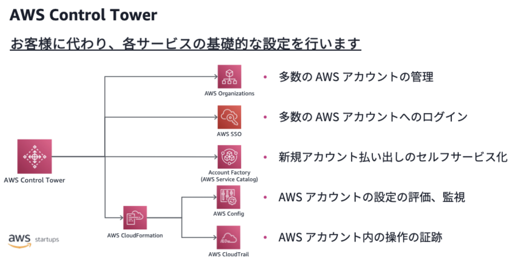

# management-and-governance
## 目的
* AWSリソースのManagemment&Governanceの知識習得
* 具体的には、AWSアカウント管理・IAMユーザー・IAMロール管理・コスト管理・コンプライアンスなど
## 背景
* 現PJがAWSアカウントごとにIAMユーザがいたり、その他MW・SW・ツールも個別のアカウントがあったりと煩雑になっており困っている
* 一方、自分は開発経験ばかりで運用経験が乏しくアカウント管理のベスプラを知らない。（開発する際もガバナンスを管理している担当者にアカウント申請をするだけなのでガバナンスの検討をしたことがない）
* ガバナンスは下記のようなジレンマを含んでいると思う
    1. ガバナンスは実際の機能を担う部分ではないため軽視されがち。ガバナンスの検討なんかに工数かけられず、開発中心になってしまいがち。
    1. でも、サービスを運用していけばいくほど重要なものになってくるし運用工数にかなり影響してくる。
    1. でも、サービスがある程度大きくなった後にガバナンスを整えるのは辛い。
    1. じゃあ、開発する前にガバナンスの地盤を整えるべき。（1に戻る。。。）
        * ジレンマを打開するためにガバナンス管理のベスプラを知っておき、開発する前に適用できるようなスキルを持っておく。

## AWSアカウントの管理
* AWSではセキュリティ・ガバナンスの強化を目的にマルチアカウントでの管理を推奨している。
    * なぜマルチアカウントなのか？
        * アカウント分割でVPCだけでなくAPIのレベルで環境を分けるこれによって「環境」「課金」「ビジネス推進」「ワークロード」の観点でそれぞれメリットがある
            >1. 1 番目は環境の分離です。VPC 分割ではネットワークレベルで分離し、IAM を用いて権限管理をしていきます。IAM を使った場合、ロールベースのアクセス制御 (RBAC) や属性ベースのアクセス制御 (ABAC) で権限管理は可能ですが、複数の環境、複数の管理主体の管理は煩雑になりがちです。アカウントを分割することによってマネージドコンソール、API 単位での分離が容易に実現できます。
            >1. 2 番目に課金です。同一アカウント内で VPC を分割して運用している各システムにおいてコストの可視化をする場合、コスト配分タグを設定し集計していく必要があります。アカウントを分割すれば、割り振られたアカウント単位で AWS のコストが表示されますので、管理がシンプルになります。また、課金に対する責任やコントロールも持たせることができます。
            >1. 3 番目にビジネス推進です。全社で統一の管理基準で運用すると、個別部門・システムの要件を満たすことができず、結果的に IT がビジネス推進を阻害してしまうことがあります。アカウントをビジネス部門ごとに払い出して完全に分離された環境をつくり、ガードレール (実施してはいけない操作を禁止したり、危険な設定を監視したりする仕組み) で管理された環境を提供することで、他部門に影響することなく、独自のポリシーで IT 環境を運用できます。また、スピードを高めるために特定のアカウントに権限を委譲することができます。
            >1. 最後にワークロードです。アカウントを分割することで、セキュリティレベル、サービスレベルが異なるワークロードを明確に分離できます。認証や認定などを取得する場合は、アカウント単位で監査及びアセスメントが実施できます。また、AWS サービスクォータアカウントごとに管理されるため、サービス上限値のプランニングが行いやすくなります。

* マルチアカウントを実現するためのサービス
    >* AWS Organizations : 多数の AWS アカウントの管理
    >* AWS Single Sign-On (SSO) : 多数の AWS アカウントへのログイン
    >* Account Factory (AWS Service Catalog) : 新規アカウント払い出しのセルフサービス化
    >* AWS Config : AWS アカウントの設定の評価、監視
    >* AWS CloudTrail : AWS アカウント内の操作の証跡
* これらのサービス設定のハードルを大幅に下げる大幅に下げるサービスが「AWS Control Tower」
    * 例えば、AWS Control Towerを用いるとAWS SSOの下記設定が簡単になる（もちろん設計は必要）
        >1. AWS SSO の有効化
        >1. ID ソース（アイデンティティストア）の選択
        >1. AWS アカウントへのシングルサインオンアクセスの管理
        >    1. ユーザー作成
        >    1. グループ作成
        >    1. ユーザーをグループに追加
        >    1. ユーザーの有効化およびパスワード設定
        >    1. アクセス権限セットのユーザー/グループへの割り当て

* 一方でマルチアカウントは難しいという声もある。
    * 具体的には
        >* 「アカウントをどう分割するのか」問題
        >* 「AWS Control Tower を活用したほうがいいのか」問題
        >* 「ユーザー管理どうするのか」問題
        >* 「最小権限とは言っても」問題
        >* 「管理アカウントでの作業が怖い」問題
        >* 「OU/SCP周りの更新が怖い」問題
        >* 「セキュリティをどう向上するか」問題
        >* 「アカウント数のスケールにどう対応するのか」問題
        >* 「ベースラインの構築/管理をどうするか」問題
        >* 「ログ集約するのか/しないのか」問題
        >* 「どのアカウントかぱっと見て分からない」問題
        >* 「Security Hub のコントロールが増えすぎ」問題

* ref
    * [スタートアップにおけるマルチアカウントの考え方と AWS Control Tower のすゝめ](https://aws.amazon.com/jp/blogs/startup/multi-accounts-and-control-tower/)
    * [AWS マルチアカウント管理を実現するベストプラクティスとは ?](https://aws.amazon.com/jp/builders-flash/202007/multi-accounts-best-practice/?awsf.filter-name=*all)
    * [増加するシステムをマルチアカウントで効率よく管理する](https://d1.awsstatic.com/events/jp/2020/innovate/pdf/S-7_AWSInnovate_Online_Conference_2020_Spring_MultiAccount.pdf)
    * [AWSのマルチアカウント戦略が難しい！](https://dev.classmethod.jp/articles/aws-multiaccount-muzu/)
## IAMユーザーの管理
* [え、IAM ユーザーを作らなくてもマネジメントコンソールにログインできるの!? – シングルサインオン考え方編](https://aws.amazon.com/jp/blogs/startup/techblog-iam-sso-concept/)
* [え、IAM ユーザーを作らなくてもマネジメントコンソールにログインできるの!? – シングルサインオン実践編](https://aws.amazon.com/jp/blogs/startup/techblog-iam-sso-practice/)

